<h1>Ansible on Clouds - AWS - RHPDS Guide</h1>


<h2>Introduction</h2>


Thank you for using the **Red Hat Ansible Automation Platform on AWS** RHPDS lab environment.

<h2>Prerequisites</h2>

<h3>Red Hat Account</h3>


You will need a valid Red Hat account in order to retrieve an Ansible entitlement once the application is deployed.  In order to avoid possible corporate permissions issues, it is recommended that you create a personal account and use this when performing this lab.  Please create a personal account and ensure that you are able to login to **[console.redhat.com](https://console.redhat.com)** successfully.  [Red Hat Hybrid Cloud Console](https://console.redhat.com/)

<h3>AWS Credentials / Keys</h3>


You will get these **from your instructor**.  You will need the console link, and the credentials to proceed.

<h2>Deploying AAP on AWS from the AWS Marketplace</h2>


<h3>Prepare Provided AWS Account with Prerequisite Resources</h3>


**Task**: Create resources necessary for successful Ansible Automation Platform on AWS deployment

**Success Criteria**: Provided AWS account is ready to deploy AAP on AWS

**Instructions**:


1. [Sign in to the AWS Console](https://aws.amazon.com/premiumsupport/knowledge-center/sign-in-console/) with the provided AWS credentials
2. [Choose a region](https://docs.aws.amazon.com/awsconsolehelpdocs/latest/gsg/select-region.html) for deploying AAP on AWS (Please use one of the following 4 regions: **us-east-1** or **us-east-2** or **us-west-1** or **us-west-2**).  Make sure the right region is selected in the top right corner of the AWS console window.
3. [Create a key pair](https://docs.aws.amazon.com/AWSEC2/latest/UserGuide/create-key-pairs.html) in the chosen region. In the navigation pane, under **Network & Security**, choose **Key Pairs**.  Choose **Create key pair**.
4. The AAP on AWS deployment will use this key pair to deploy EC2 instances in the chosen region. Use the name **\<your-initials\>-aaponaws-\<monthyear\> (ex: hm-aaponaws-jan2023)**, Key pair type **ed25519**, and Private key file format **.pem**. Replace <your-initials> with your initials.

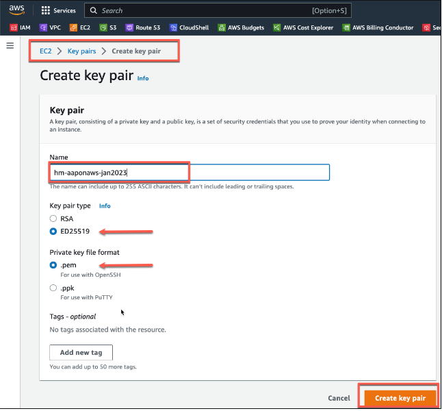

5. Please note, it could take up to 5 minutes for the key pair to show up in the UI for some regions.
6. When prompted to save the .pem key please save it to your desktop.

<h3>AWS Marketplace</h3>


**Task**: Subscribe to the Red Hat Ansible Automation Platform on the **AWS PRIVATE OFFER** in the AWS Marketplace.

**Success Criteria**: Successful subscription to Red Hat Ansible Automation Platform on AWS **(PRIVATE OFFER)**.

**Instructions**:


1. Make sure you are **logged in to the AWS console** using the credentials provided by your instructor.
2. Link for **AAP on AWS Foundation (Base Ansible) - Private offer**:  [https://aws.amazon.com/marketplace/fulfillment?productId=2bedd837-fd50-4766-8ea0-7efc4fce9397&offerId=offer-yux6vytisewry](https://aws.amazon.com/marketplace/fulfillment?productId=2bedd837-fd50-4766-8ea0-7efc4fce9397&offerId=offer-yux6vytisewry)
3. Copy and paste the foundation private offer link in your browser
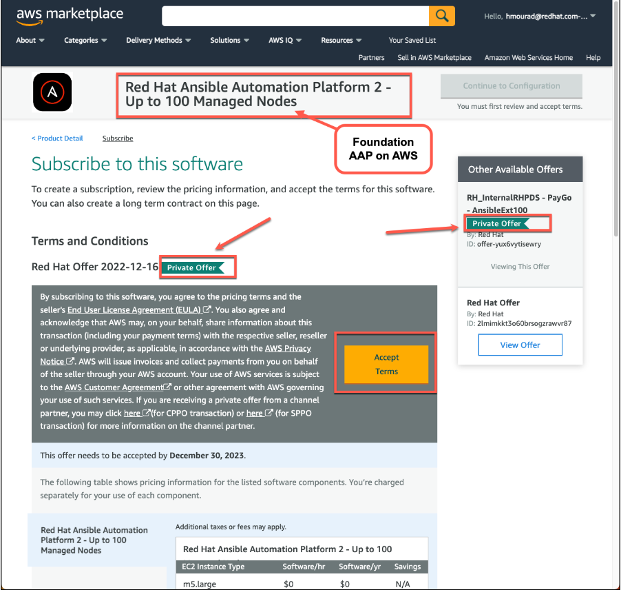

4. Click on **Accept Terms**.  Wait a few moments until the subscription process is complete.  You will see a note stating **Thank you for subscribing to this product!  We are processing your request.**
5. After selecting **Accept Terms**, it will take a couple of minutes. Next go to the **Manage subscriptions **AWS console menu, then you will see the following:

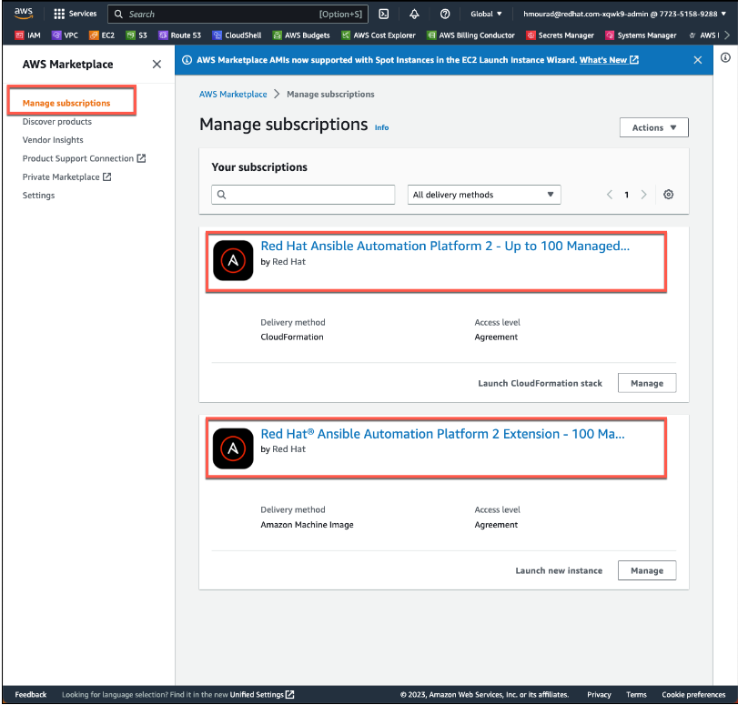

6. Now you are [Subscribed to the AMI Private Offer](https://docs.aws.amazon.com/marketplace/latest/buyerguide/buyer-private-offers-subscribing-ami-private-offer.html) named **Red Hat Ansible Automation Platform 2 - Up to 100 Managed Nodes.**
7. After subscribing to the Foundational offer, Let’s go ahead and start to deploy Ansible Automation Platform on AWS.

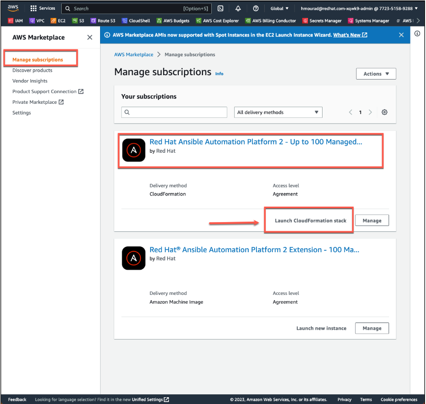

<h3>Application Deployment</h3>

**Task**: Provision Red Hat Ansible Automation Platform on AWS.

**Success Criteria**: Successful deployment of Red Hat Ansible Automation Platform infrastructure and resources into your AWS environment.

**Instructions**:


1. Now that you have launched the cloudformation stack, you’re ready to start configuration prior to launching the AAP on AWS offer.
2. For the **Fulfillment option**, please select **Ansible Platform CloudFormation Topology.**
3. For the **Software version**, please select the latest version / date available in the list.
4. For the **Region**, please select the region that you decided on earlier
5. Select **Continue to Launch**.

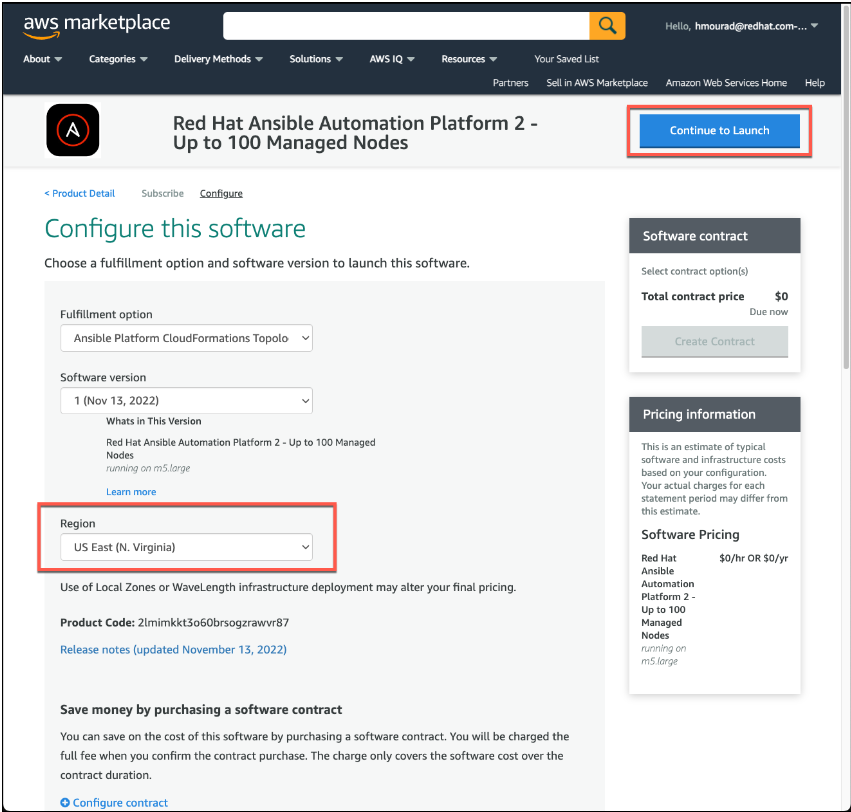

6. On the following screen, select **Launch CloudFormation** from the **Choose Action** dropdown list, and then select **Launch**.

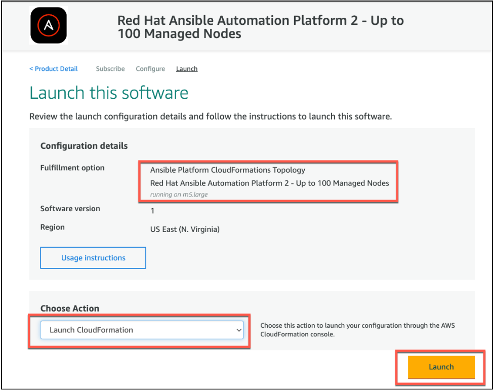

7. Step 1, **Create Stack**.  Select **Next**

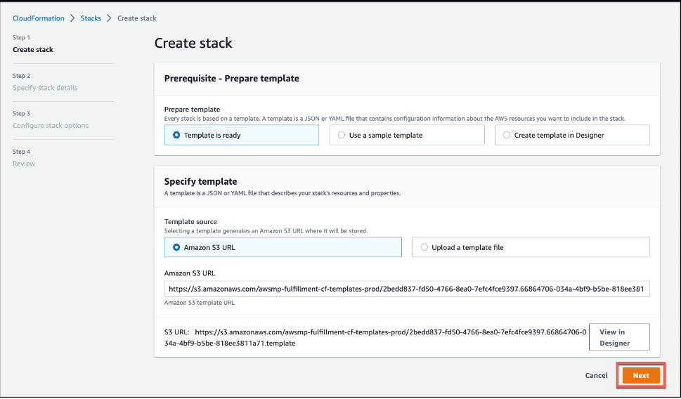

8. Step 2, **Specify stack details**
    1. Please enter the unique stack name (Replace \<your-initials\> with your initials): **\<your-initials\>-aaponaws01**
    2. **\<your-initials\>-aaponaws-\<monthyear\>** from the drop-down menu,
    3. Select **Next** to move to step 3.

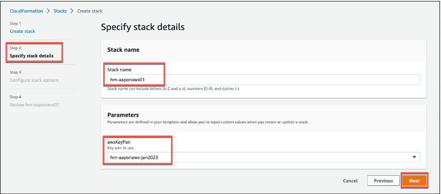

9. Step 3, **Configure stack options**.  No changes are necessary. All configurations are optional or have the correct default values. Scroll to the bottom, and select **Next** until you reach Step 4, Review
10. Step 4, **Review <stackname>**.  Scroll to the bottom, then under **Capabilities**, acknowledge that CloudFormation may create IAM resources by **selecting the checkbox**.  Then select **Submit**.

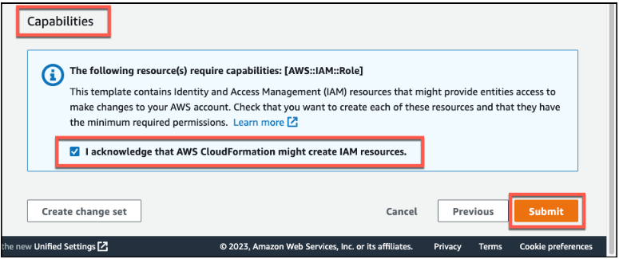

The application will begin provisioning.

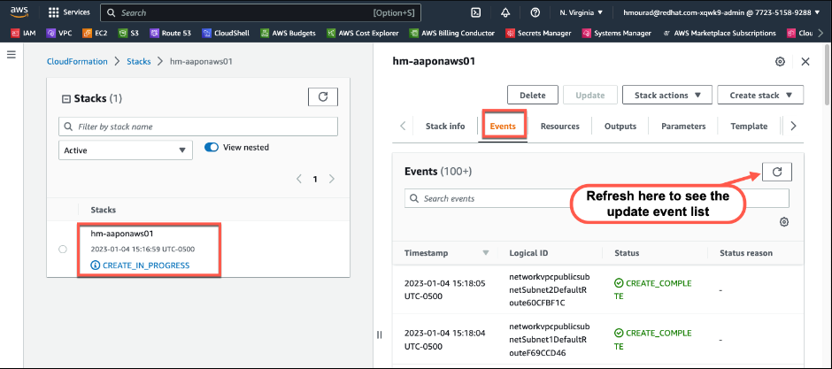

It may take 30 minutes or longer for the infrastructure and application to fully provision.


---
**NOTE:**
**Troubleshooting / Workaround note**.  If for some reason you experience a deployment failure you will need to delete the deployment stack, wait a few minutes, and start over please.
---
<h3>Network Access</h3>


When AAP on AWS is deployed, it is deployed into an isolated VPC and cannot be accessed.    The following instructions will follow a model of exposing the Ansible UIs and APIs to the public internet for access.  There are other ways to access the platform via private networks, but those require advanced configuration that is not covered in the scope of this environment.

**Task**: Once the AAP application is provisioned, add the necessary AWS configuration to access the Automation Controller and the Private Automation Hub user interfaces.

**Success Criteria**: The ability to access both Automation Controller and Private Automation Hub user interfaces.

**Instructions**:

AAP on AWS is deployed into its own VPC on a private network.  In order to access the application UI’s (controller and hub) there are some steps to follow


1. First, please verify that you are still in the same AWS region that you created your AAP on AWS deployment.
2. Create a target group for the Automation Controller.  From the **EC2 dashboard** scroll down to the **Target Groups** under **Load Balancing**.
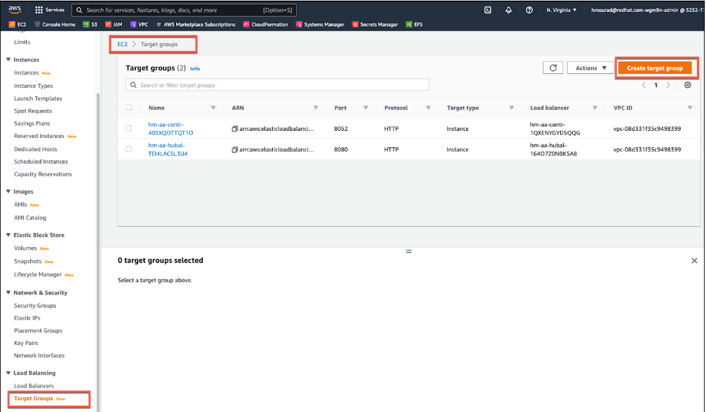

2.1. Select **Create target group**.  For Target type, change from Instance to **Application Load Balancer**.  Enter a **Target group name** of **controller-tg**, then from the **VPC** drop-down select your **aap/network/vpc**.  Then click **Next**.
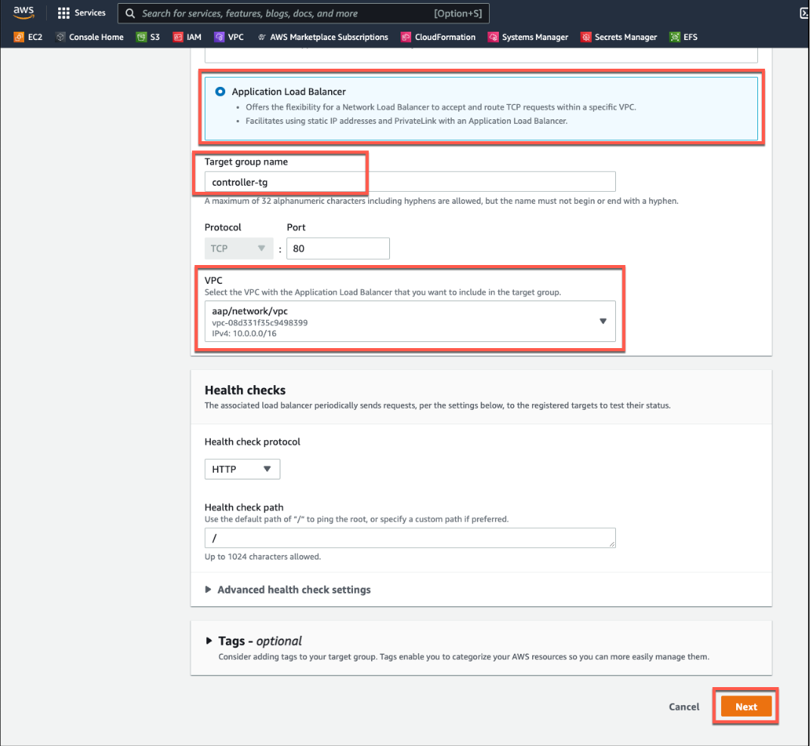

2.2. On the next screen register the target(s).  From the drop-down select the **Controller’s** load balancer. It will be named **\<your-initials\>-aa-contr-\<generated-string\>,** where **\<your-initials\>** is your initials and **\<generated-string\>** is a string of random characters.  Then select **Create target group**.
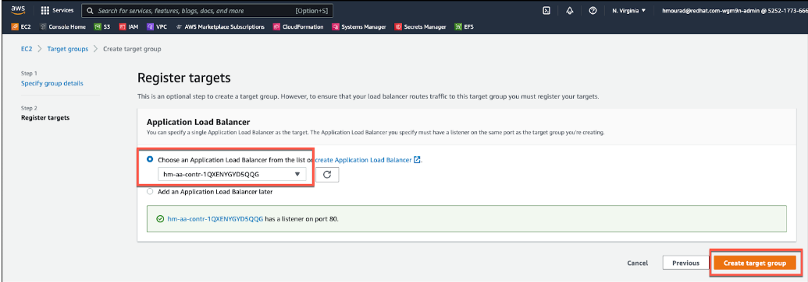


3. Similarly, Create a target group for the Private Automation Hub.  From the **EC2 dashboard** scroll down to the **Target Groups** under **Load Balancing**.
    1. Select **Create target group**.  For Target type, change from Instance to **Application Load Balancer**.  Enter a **Target group name** of **hub-tg**, then from the **VPC** drop-down select your **aap/network/vpc**.  Then click **Next**.
    2. On the next screen register the target(s).  From the drop-down select the **Hub’s** load balancer.  It will be named **\<your-initials\>-aa-hubal-\<generated-string\>,** where **\<your-initials\>** is your initials and **\<generated-string\>** is a string of random characters. Then select **Create target group**.

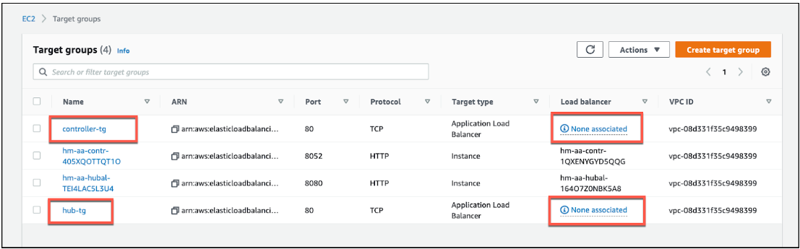

4. Now, select  **Load Balancers** in the **Load Balancing** menu.
5. Create a network load balancer for the Automation Controller
    1. Select **Create Load Balancer**, then from the screen you are presented with, select **Create** under the **Network Load Balancer** column
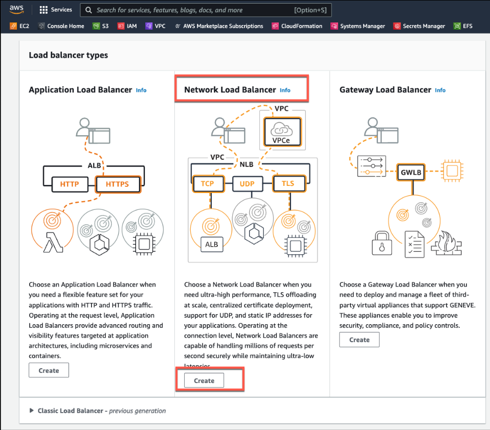
    2. For the Load balancer name call it **controller**
    3. From the **VPC** drop-down select your **aap/network/vpc**.
    4. Under **Mappings** select the availability zones and from the drop-down make sure you have selected the **PUBLIC subnet**
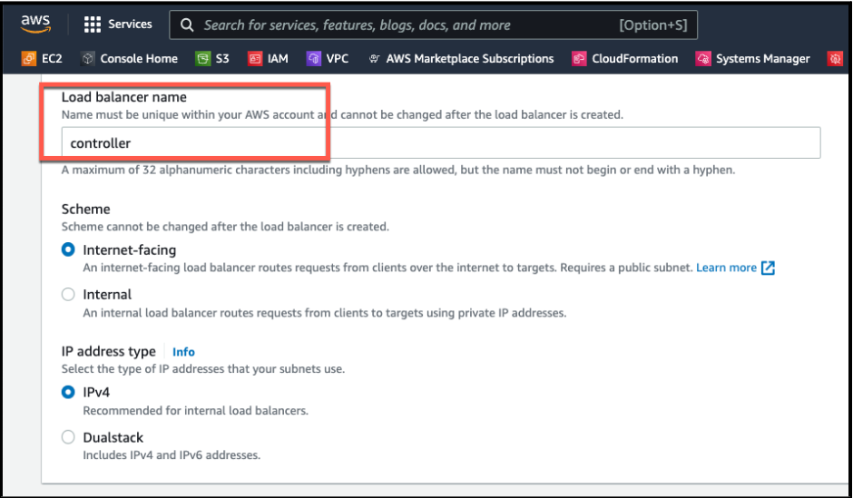
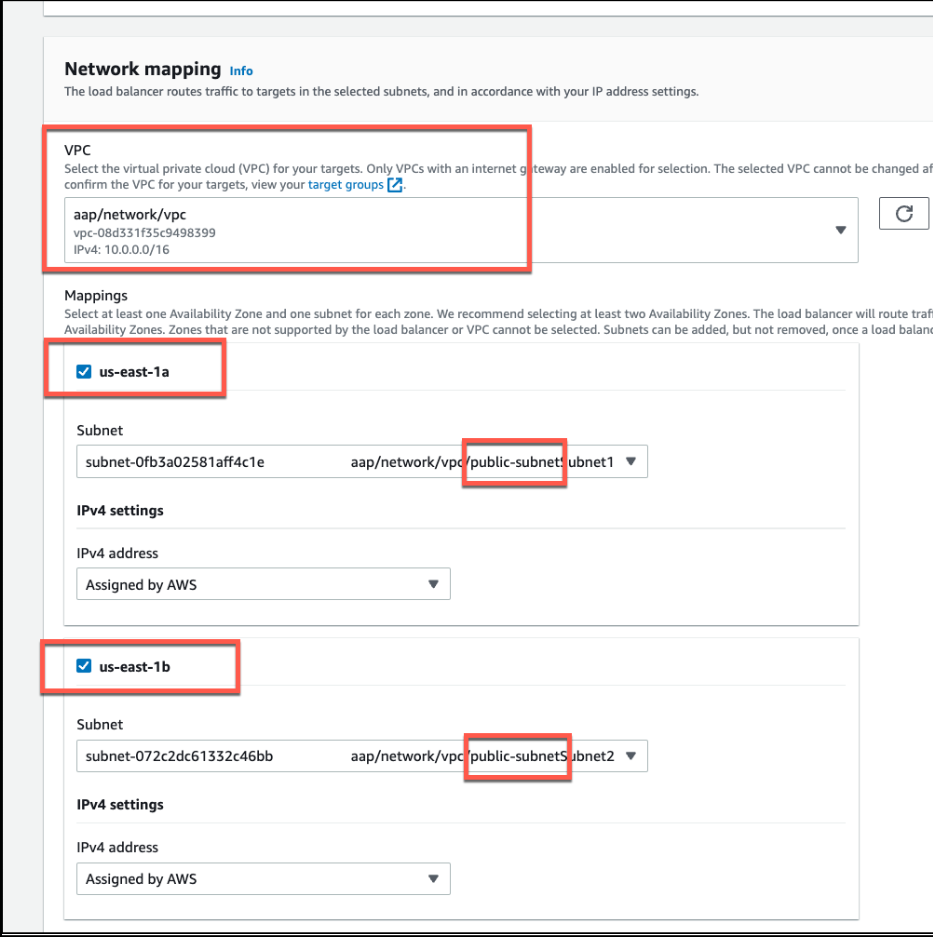
    5. Continue scrolling down to create a TCP Listener under **Listeners and routing**.
    6. From the **Default action** drop-down select **controller-tg**, then scroll down and select **Create load balancer**
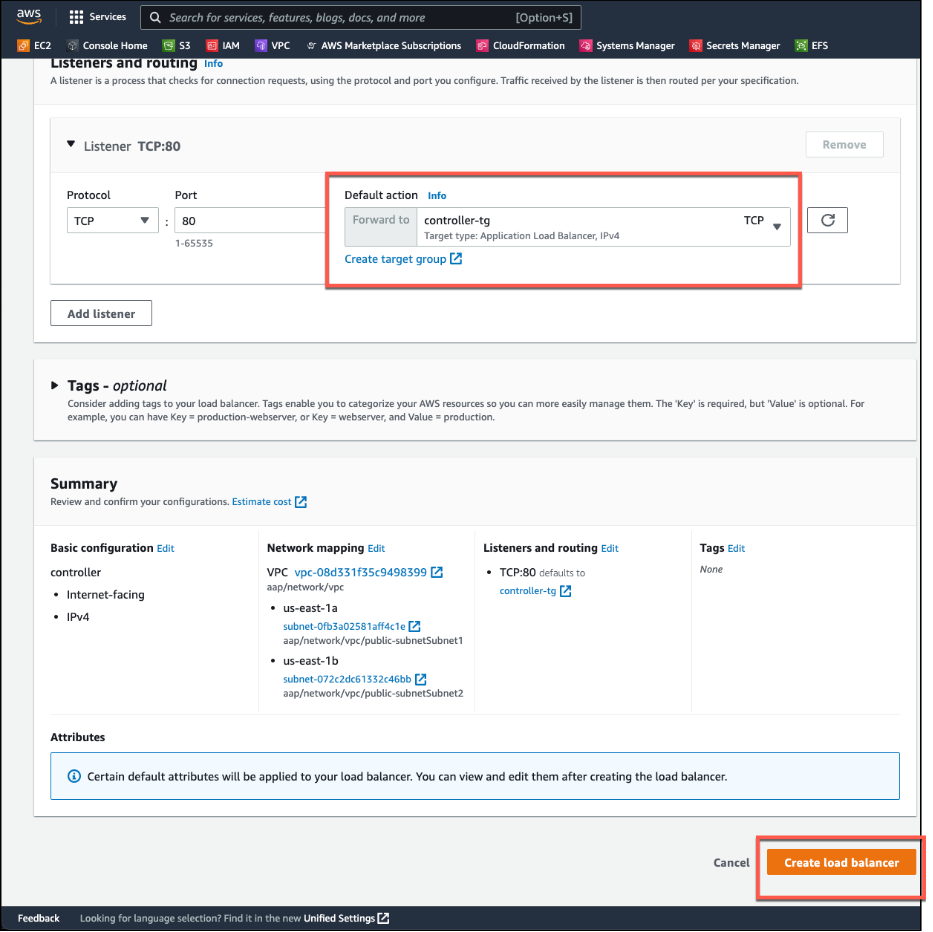
6. Similarly, create a network load balancer for the Private Automation Hub
    1. Return to the **Load Balancers** console.
    2. Select **Create Load Balancer**, then from the screen you are presented with, select **Create** under the **Network Load Balancer** column
    3. For the Load balancer name call it **hub**
    4. From the **VPC** drop-down select your **aap/network/vpc**.
    5. Under **Mappings** select the availability zones and from the drop-down make sure you have selected the **PUBLIC subnet**
    6. Continue scrolling down to create a TCP Listener under **Listeners and routing.**
    7. From the **Default action** drop-down select **hub-tg**, then scroll down and select **Create load balancer**
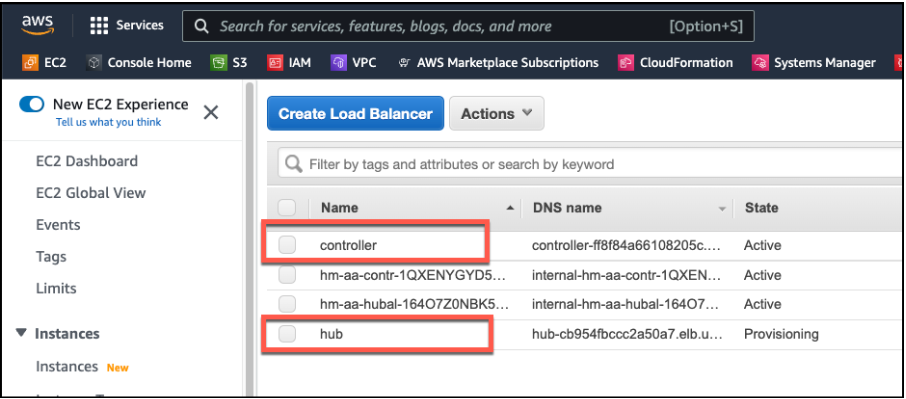

7. Visit the **Load Balancers** console to view the load balancers you created. **It might take a few minutes** for the load balancer status to change from **Provisioning** to **Active.** Continue to the next step when both Load Balancers have a **State** of **Active**.
8. To get the URLs for the Automation controller and Private automation hub, select each load balancer respectively (**controller** and **hub**), and copy the **DNS name** URL.

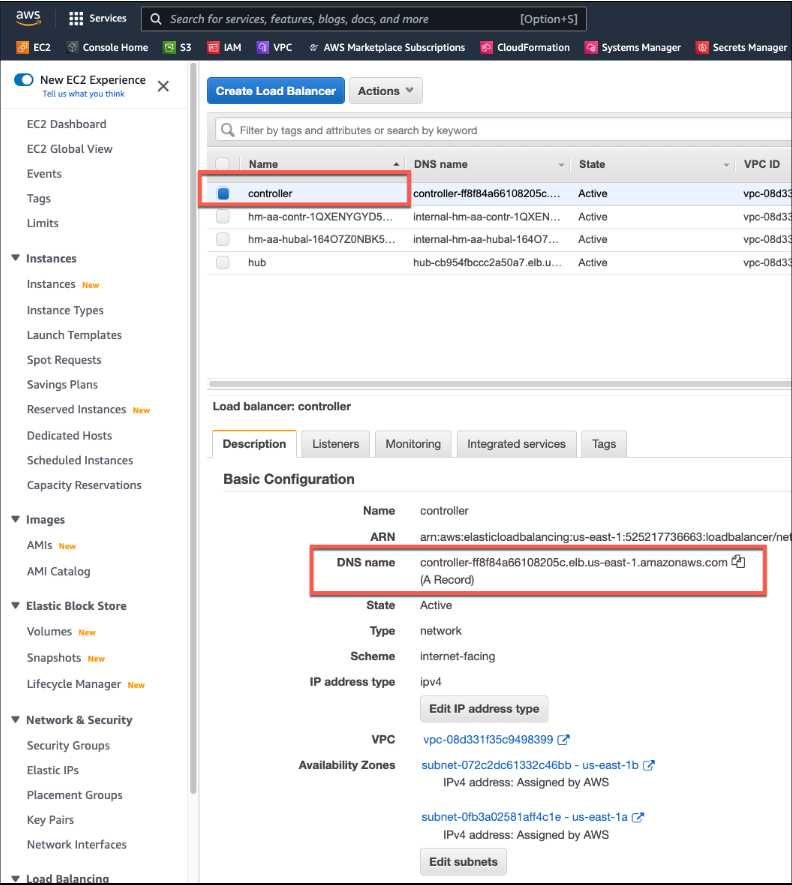

9.  Open two browser tabs with the controller and hub URLs.
    1. Expected Controller UI
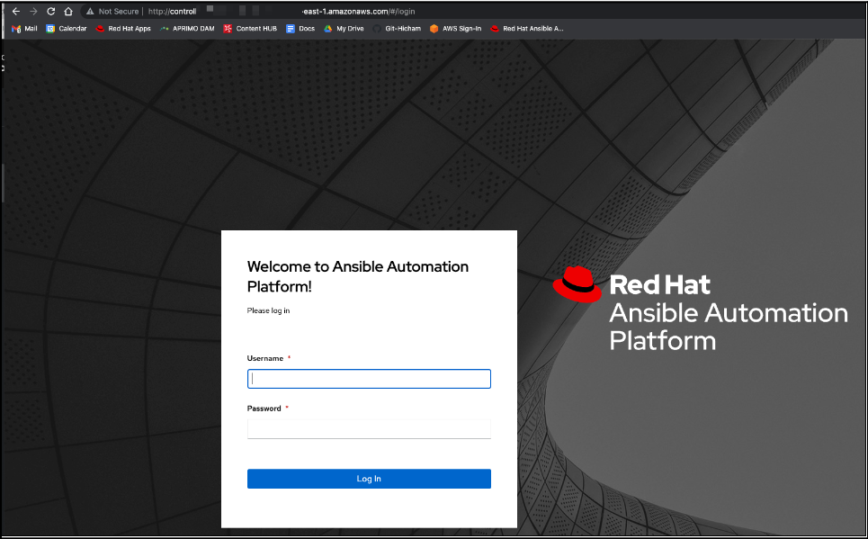
    2. Expected Hub UI:
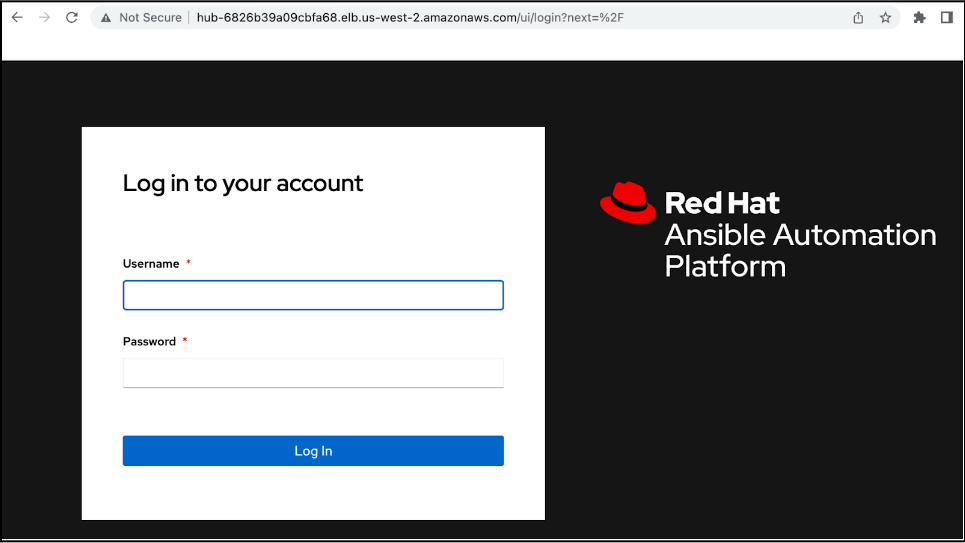

***
<h3>Application Access</h3>


**Task**: Access the **admin** password for the Automation Controller and Private Automation Hub.

**Success Criteria**: Obtained admin password and successfully logged in to both controller and hub graphical user interfaces.

**Instructions**:

1. Open the AWS **Secrets Manager** service, and select **Secrets**
2. Select the **Secret name** that ends with **-aap-admin-secret**

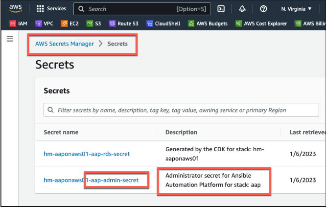

3. On the next screen scroll down to the **Secret value** section, and select **Retrieve secret value**, and copy the **admin** password.
4. Login to the Automation Controller and the Private Automation Hub.

***
**Task**: Access Automation Controller console.

**Success Criteria**: Automation Controller console accessed and developer subscription enabled

**Instructions**:


1. Login to the Automation Controller using the **admin** username and password
2. Activate a Red Hat Ansible Automation Platform subscription
    1. **_Associate subscription from access.redhat.com_**
        1. Select the **Username / password** tab.
        2. Use your Red Hat credentials (access.redhat.com) to retrieve subscription options.
        3. Select a subscription. The **60 Day Product Trial** for **Red Hat Ansible Automation Platform** is a safe default.
        4. Select **Next**.
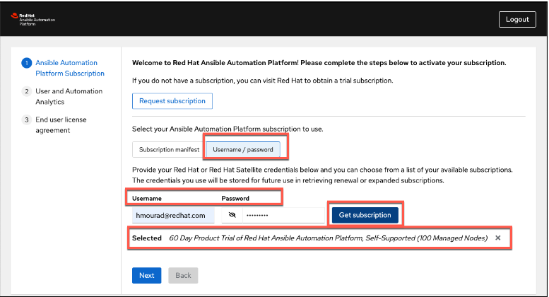
3. User and Automation Analytics
    1. Disable User analytics and Automation Analytics by unselecting the check boxes.
    2. Select **Next**.
4. End user license agreement
    1. Read the agreement and select **Submit**.

***
**Task**: Access Private Automation Hub console.

**Success Criteria**: Private Automation Hub console accessed

**Instructions**:


1. Login to the Private Automation Hub using the **admin** username and password.

***
<h3>Automation Controller Configuration</h3>


<h4>Credentials</h4>


<h5>AWS - Credentials</h5>


1. Click the “**Resources**” in the left menu, then click “**Credentials**”.
2. Click the “**Add**” button.
3. Select “**Amazon Web Services**” from the **Credential Type** drop down menu.
4. Fill the following fields:
    1. **Name:** AWS - Access Key
    2. **Access Key:** Use the access key provided via RHPDS.
    3. **Secret Key:** Use the secret key provided via RHPDS.
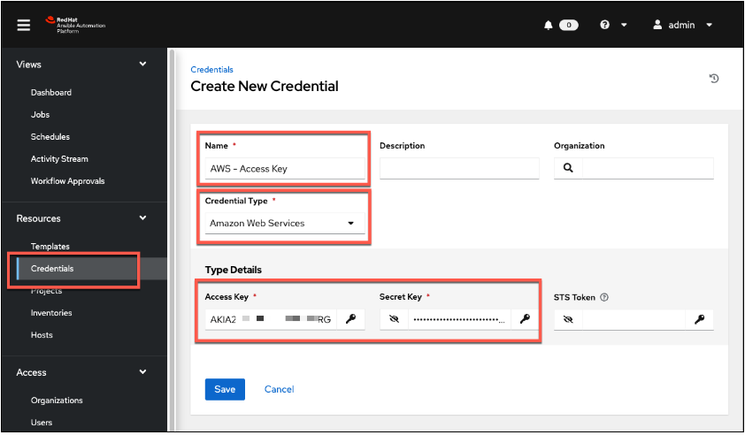
5. Click the “**Save**” button.

***
<h4>Execution Environment</h4>

1. Click the “**Execution Environments**” link under “**Administration**” in the left menu.
2. Click the “**Add**” button.
3. Fill the following fields:
    1. **Name**: Cloud EE
    2. **Image**: quay.io/scottharwell/aws-ee:latest
4. Click “**Save**” at the bottom of the screen.

***
<h4>Projects</h4>


<h5>Cloud Content Lab - AWS Demos</h5>


1. Click the “**Projects**” link under “**Resources**” in the left menu.
2. Click the “**Add**” button.
3. Fill the following fields:
    1. **Name**:  AWS - Content Lab Infrastructure Config Demos
    2. **Execution Environment**: Cloud EE
    3. **Organization**: Default
    4. **Source Control Type**: Git
    5. **Source Control URL**: https://github.com/ansible-content-lab/aws.infrastructure_config_demos.git
4. Click “**Save**” at the bottom of the screen.

Make sure it has synchronized and shows “**Successful**”.  If it doesn’t show successful you can click on the synchronize **icon** in the **Actions** column. \

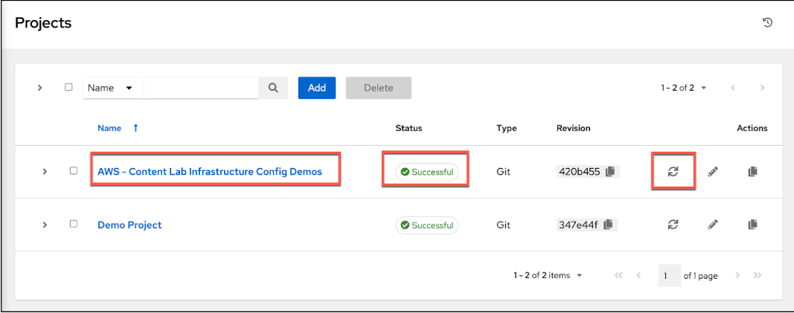

***
<h4>Templates (Create Job Templates)</h4>

<h5>Create Transit Network</h5>


This job will deploy a transit peering network model as described in the collection [readme](https://github.com/ansible-content-lab/aws.infrastructure_config_demos/blob/main/roles/manage_transit_peered_networks/README.md).


1. Click the “**Templates**” link under “**Resources**” in the left menu.
2. Click the “**Add**” button, then “**Add job Template**”.
3. Fill the following fields:
    1. **Name**: AWS - Create Transit Network
    2. **Job Type**: Run
    3. **Inventory**: Demo Inventory
    4. **Project**: AWS - Content Lab Infrastructure Config Demos
    5. **Playbook**: playbook_create_transit_network.yml
    6. **Credentials**: AWS - Access Key
    7. **Variables**: Add the below to the Variables window frame.

```
---
aws_region: <your-aws-region> # replace with your region
priv_network_instance_ami: ami-06640050dc3f556bb # Replace with the proper RHEL AMI for your region. A table of AMIs is below.
dmz_instance_ami: ami-06640050dc3f556bb # Replace with the proper RHEL AMI for your region. A table of AMIs is below.
dmz_ssh_key_name: <your-initials>-aaponaws-<monthyear> # replace with the name of the AWS SSH key that you created at the start of this exercise
priv_network_ssh_key_name: <your-initials>-aaponaws-<monthyear> # replace with the name of the AWS SSH key that you created at the start of this exercise
```


When finished, the variable section will look like the following:


```
---
aws_region: <your-aws-region>
priv_network_instance_ami: ami-<your-region-ami#>
dmz_instance_ami: ami-<your-region-ami#>
dmz_ssh_key_name: <your-initials>-aaponaws-<monthyear>
priv_network_ssh_key_name: <your-initials>-aaponaws-<monthyear>
```


My example is:


```
---
aws_region: us-east-1
priv_network_instance_ami: ami-06640050dc3f556bb
dmz_instance_ami: ami-06640050dc3f556bb
dmz_ssh_key_name: hm-aaponaws-jan2023
priv_network_ssh_key_name: hm-aaponaws-jan2023
```


<table>
  <tr>
   <td><strong>AWS Region</strong>
   </td>
   <td><strong>RHEL AMI</strong>
   </td>
  </tr>
  <tr>
   <td>eu-central-1
   </td>
   <td>ami-0e7e134863fac4946
   </td>
  </tr>
  <tr>
   <td>us-east-1
   </td>
   <td>ami-06640050dc3f556bb
   </td>
  </tr>
  <tr>
   <td>us-east-2
   </td>
   <td>ami-092b43193629811af
   </td>
  </tr>
  <tr>
   <td>us-west-1
   </td>
   <td>ami-0186e3fec9b0283ee
   </td>
  </tr>
  <tr>
   <td>us-west-2
   </td>
   <td>ami-08970fb2e5767e3b8
   </td>
  </tr>
</table>


4. Click “**Save**” at the bottom of the screen.

<h5>Delete Transit Network</h5>


1. Click the “**Templates**” link under “**Resources**” in the left menu.
2. Click the “**Add**” button, then “**Add job Template**”.
3. Fill the following fields:
    1. **Name**:  AWS - Delete Transit Network
    2. **Job Type**: Run
    3. **Inventory**: Demo Inventory
    4. **Project**: AWS - Content Lab Infrastructure Config Demos
    5. **Playbook**: playbook_delete_transit_network.yml
    6. **Credentials**: AWS - Access Key
    7. **Variables**:

```
---
aws_region: <your-aws-region> # Replace with your region
```


4. Click “**Save**” at the bottom of the screen.

***
<h5>Create VM</h5>


This job will create a virtual machine in an existing AWS VPC as described in the collection [readme](https://github.com/ansible-content-lab/aws.infrastructure_config_demos/blob/main/README.md).


1. Click the “**Templates**” link under “**Resources**” in the left menu.
2. Click the “**Add**” button, then “**Add job Template**”.
3. Fill the following fields:
    1. **Name**: AWS - Create RHEL 8 VM
    2. **Job Type**: Run
    3. **Inventory**: Demo Inventory
    4. **Project**: AWS - Content Lab Infrastructure Config Demos
    5. **Playbook**: playbook_create_vm.yml
    6. **Credentials**: AWS - Access Key
    7. **Variables, please check “Prompt on launch”**.  **This is because some of these values won’t be available until later AFTER you run the “AWS - Create Transit Network” job template.**

```
---
tenancy: default
aws_profile: default
aws_region: <your-aws-region>
vm_ami: ami-06640050dc3f556bb # Replace with the proper RHEL AMI for your region. A table of AMIs is below.
instance_type: t2.micro
instance_name: test_vm
ssh_key_name: <your-initials>-aaponaws-<monthyear> # Replace with the name of the AWS SSH key that you created at the start of this exercise
vpc_subnet_id: subnet-02abd631b6f????? # Replace with subnet id for DMZ VPC on launch
security_group_id: sg-06c7384e268????? # Replace with security group id for DMZ subnet on launch
```


The finished Variable section will look like the following:


```
---
tenancy: default
aws_profile: default
aws_region: <your-aws-region>
vm_ami: ami-<your-region-ami#>
instance_type: t2.micro
instance_name: test_vm
ssh_key_name: <your-initials>-aaponaws-<monthyear>
vpc_subnet_id: subnet-02abd631b6f?????
security_group_id: sg-06c7384e268?????
```


<table>
  <tr>
   <td><strong>AWS Region</strong>
   </td>
   <td><strong>RHEL AMI</strong>
   </td>
  </tr>
  <tr>
   <td>eu-central-1
   </td>
   <td>ami-0e7e134863fac4946
   </td>
  </tr>
  <tr>
   <td>us-east-1
   </td>
   <td>ami-06640050dc3f556bb
   </td>
  </tr>
  <tr>
   <td>us-east-2
   </td>
   <td>ami-092b43193629811af
   </td>
  </tr>
  <tr>
   <td>us-west-1
   </td>
   <td>ami-0186e3fec9b0283ee
   </td>
  </tr>
  <tr>
   <td>us-west-2
   </td>
   <td>ami-08970fb2e5767e3b8
   </td>
  </tr>
</table>


4. Click “**Save**” at the bottom of the screen.

***
<h5>Delete VM</h5>


1. Click the “**Templates**” link under “**Resources**” in the left menu.
2. Click the “**Add**” button, then “**Add job Template**”.
3. Fill the following fields:
    1. **Name**: AWS - Delete RHEL 8 VM
    2. **Job Type**: Run
    3. **Inventory**: Demo Inventory
    4. **Project**: AWS - Content Lab Infrastructure Config Demos
    5. **Playbook**: playbook_delete_vm.yml
    6. **Credentials**: AWS - Access Key
    7. **Variables (prompt on launch checked)**:

```
---
aws_region: <your-aws-region> # Replace with your region
```


4. Click “**Save**” at the bottom of the screen.

***
<h3>Content Testing</h3>


<h4>Ansible Automation Controller Functionality</h4>


**Task**: Verify that Ansible Automation Controller works as expected given your experience with Automation Controller in AAP.

**Success Criteria**: Ability to run pre-configured or provided job templates.

**Instructions**:


1. Run “**AWS - Create Transit Network**” template (will take 10 minutes or more to complete).  **Resources** -> **Templates** -> “**AWS - Create Transit Network**”, and click the launch icon.   **When the job has completed Successfully**, move to step 2.
2. In the AWS Console, verify that you now have the following architecture deployed in the region that you defined in the extra-vars for the template.
    1. EC2 Dashboard screen - Ensure that there are **two new EC2 instances** running (dmz-..., priv-....)
    2. VPC dashboard screen - Ensure that there are **two new VPCs** (dmz-vpc, private-network-vpc), in addition to the one originally created by the AAP on AWS deployment.
    3. VPC dashboard screen - Ensure that there are **additional subnets** (dmz-subnet, priv-net-public-subnet, priv-net-private-subnet).
    4. VPC Dashboard screen - Ensure that there is a **Transit Gateway** (transit-gw)
    5. Ensure that there are **Transit Gateway peerings** between the two VPCs. (VPC dashboard -> Transit gateways -> Transit gateway attachments).  (dmz-peer, priv-network-peer)

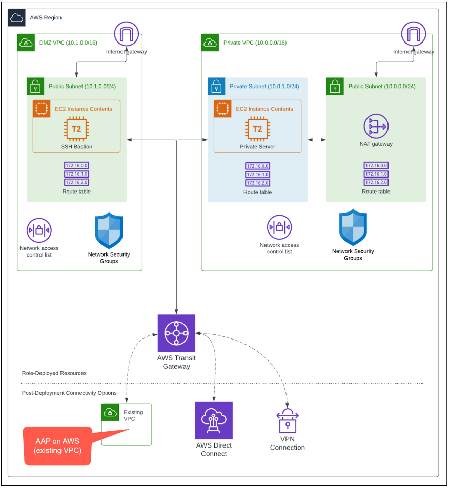

3. In the AWS Console - **VPC Dashboard** -> **Your VPCs** -> **dmz-vpc** , collect the “**Subnet ID**“ for the **DMZ-VPC** subnet and the “**Security group ID**” for the subnet.

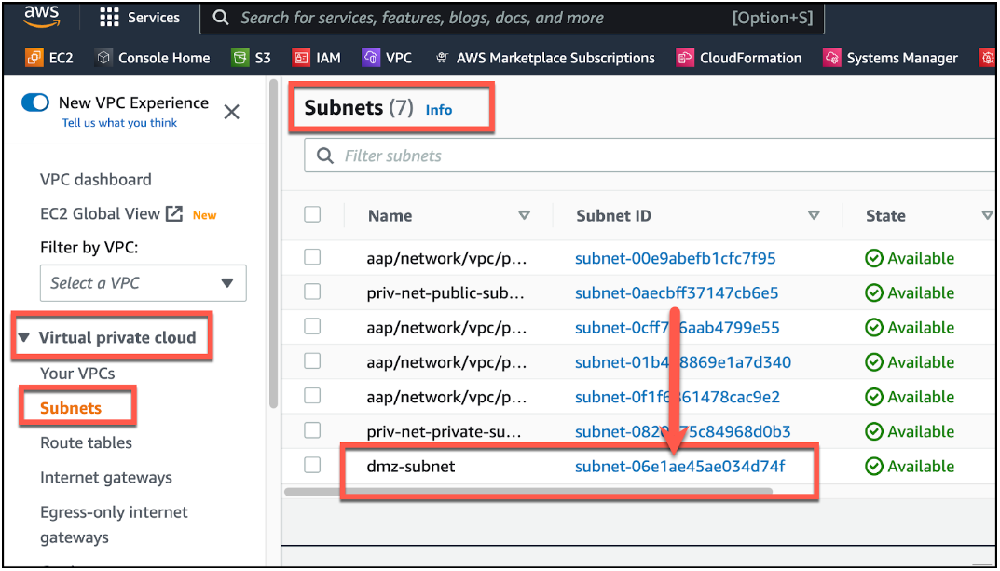

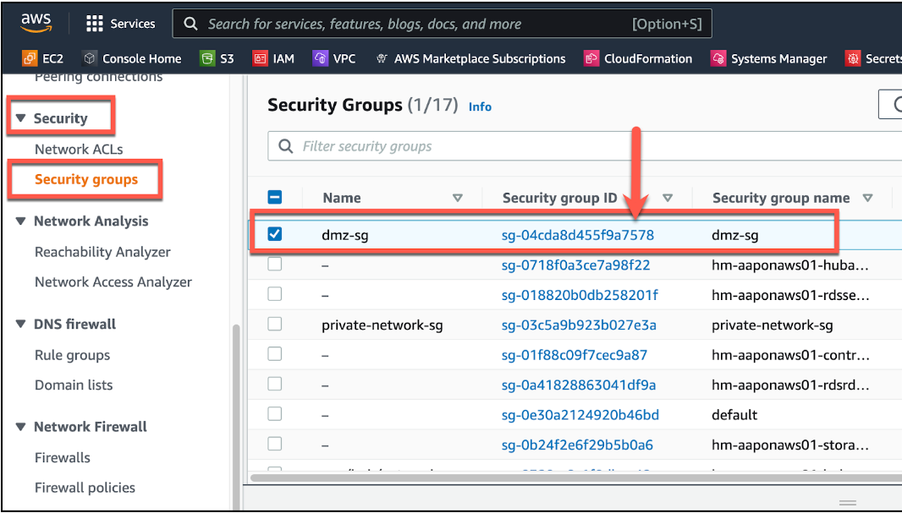

4. Run the “**AWS - Create RHEL 8 VM**” template.  Since you configured the extra vars to be configured on launch, update the “**vpc_subnet_id**” and “**security_group_id**” variables with the **values that you collected in the previous step**.
    1. You will be prompted for the variables.  Here again is a sample clean variable file snippet.

```
---
tenancy: default
aws_profile: default
aws_region: <your-aws-region>
vm_ami: ami-<your-region-ami#>
instance_type: t2.micro
instance_name: test_vm
ssh_key_name: <your-initials>-aaponaws-aug2022
vpc_subnet_id: subnet-02abd631b6f?????
security_group_id: sg-06c7384e268?????
```


5. Verify that you have a new EC2 instance running **test_vm**.

***
<h3>Deprovision Resources</h3>


**Task**: Deprovision the instance of Red Hat Ansible Automation Platform on AWS.

**Success Criteria**: Removal of all Red Hat Ansible Automation Platform on AWS resources within your AWS  environment.

<h4>Deprovision the Deployed Resources</h4>


**Instructions**:


1. Run the “**AWS - Delete RHEL 8 VM**” template (can take 3 - 5 mins).
2. Run the “**AWS - Delete Transit Network**” template (can take approx 20 mins).
3. Delete the 2 **Network load balancers** you created earlier.  (These were created outside of the AAP on AWS cloudformation deployment)
4. Delete the 2 **Target groups** you created earlier.  (These were created outside of the AAP on AWS cloudformation deployment)
5. Follow instructions on [Deleting a stack on the AWS CloudFormation console](https://docs.aws.amazon.com/AWSCloudFormation/latest/UserGuide/cfn-console-delete-stack.html). This process can take up to 45 minutes or more.

**NOTE:  (Only perform steps 3 through 5 if you do NOT want to perform the testing in the Appendix)**.

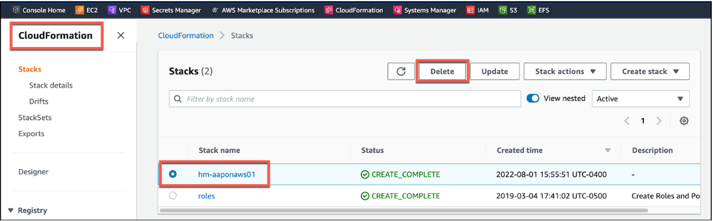


<h2></h2>

***
<h2>Appendix</h2>


---

<h3>Optional Testing</h3>


<h4>Custom Automation Testing</h4>


**Task**: Verify an existing automation that is not provided by Red Hat works

**Success Criteria**: Identification that your existing automation works as expected using Red Hat Ansible Automation Platform on AWS

**Instructions**:

Customers have the full functionality of the Ansible Automation Platform as part of their deployment on AWS.  If you regularly use Ansible Automation Platform and you have playbooks that you use, then please feel free to test their operational ability within your AAP on AWS environment.

<h4>Private Automation Hub (synchronize curated Ansible content)</h4>


**Task**: Synchronize curated Ansible content from galaxy.ansible.com (community content), and then from Red Hat Automation Hub (Red Hat certified content).

**Success Criteria**: The content will synchronize successfully and be available in the Private Automation Hub.

<h5>Synchronize **Red Hat Certified** Ansible content</h5>


**Instructions**:


1. Log in to the Private Automation Hub UI.  Use admin for the username, and the Administrator Password you retrieved earlier.
2. Expand the “**Collections**” menu on the left, and then select “**Collections**”, adjust the “**Filter by repository**” to “**Red Hat Certified**” and notice you have NO content there.
3. Select “**Repository Management**” from the menu on the left, and then select “**Remote**”.
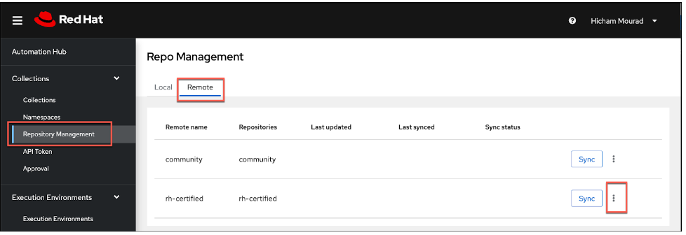

4. Select the **3 vertical dots** (vertical ellipsis), and then select “**Edit**” to synchronize Red Hat certified content from Red Hat Automation Hub on console.redhat.com.
5. Here you have **two options**, the first is to use a **Token**, <span style="text-decoration:underline;">OR</span> the second which is to use your **Red Hat account** on console.redhat.com.  I would recommend **TOKEN**.

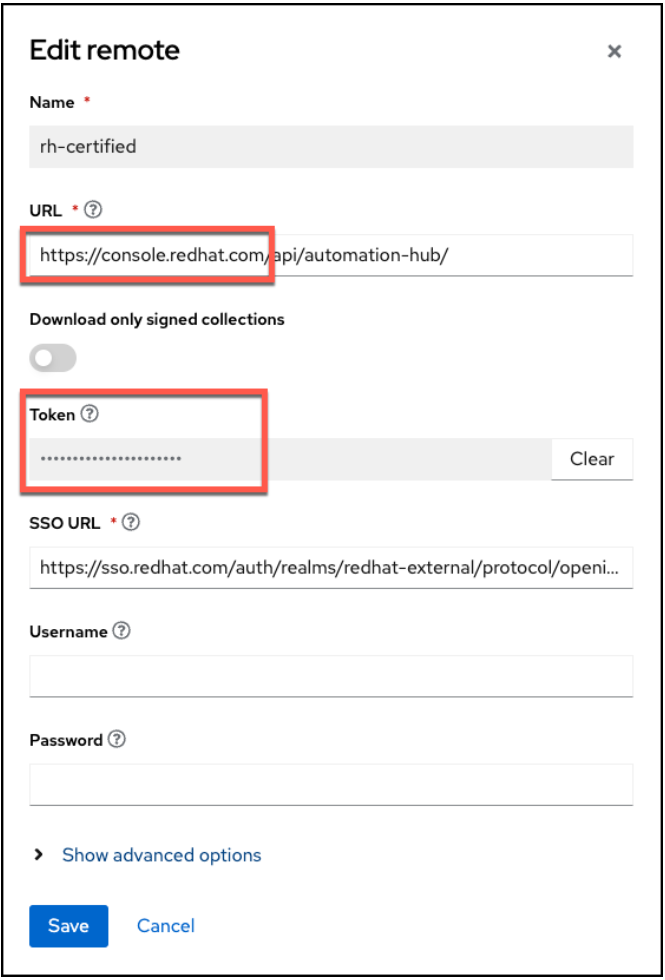

6. If you choose to use the **Token** connection method, you will have to login to console.redhat.com and go to the Ansible Automation Hub, and grab the Token.

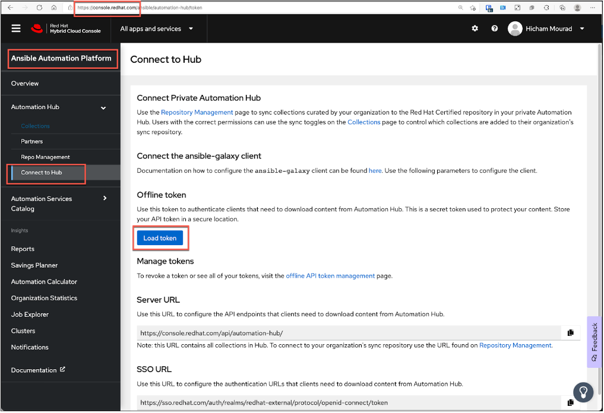

7. Insert the Token you just grabbed from console.redhat.com <span style="text-decoration:underline;">OR</span> your Red Hat username and password in the connection dialog and click “**Save**”, and then select the “**Sync**” button.  After a few minutes you should see this has completed successfully.

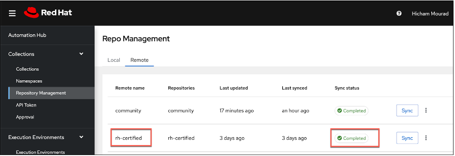

8. Go back to the “**Collections**” menu on the left, and then select “**Collections**”, adjust the “**Filter by repository**” to “**Red Hat Certified**” and notice you now DO have content there.

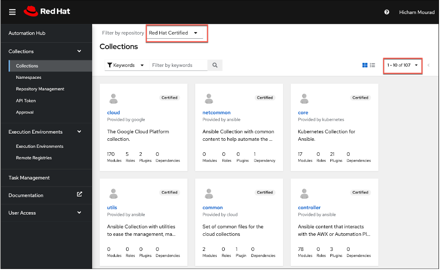

9. This Red Hat Certified content can now be consumed by the Ansible Automation Controller.

<h5>Synchronize curated Ansible **Community** content</h5>


**Instructions**:


1. Log in to the Private Automation Hub UI.  If you don’t have the URL, please copy it from the Azure AAP application on the “**Parameters and OutPuts**” page.  Look for “**automationHubUrl**”.
2. Expand the “**Collections**” menu on the left, and then select “**Collections**”, adjust the “**Filter by repository**” to “**Community**” and notice you have NO content there.
3. Select “**Repository Management**” from the menu on the left, and then select “**Remote**”.

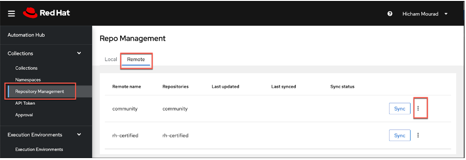

4. Select the **3 vertical dots** (vertical ellipsis), and then select “**Edit**” to configure the community repository ([https://galaxy.ansible.com](https://galaxy.ansible.com)) connection and configuration.

5. Create a file on your computer called **requirements.yml** with the following content.


```
---
collections:
 # Install a collection from Ansible Galaxy.

 - name: community.mongodb
   source: https://galaxy.ansible.com

 - name: community.general
   source: https://galaxy.ansible.com

```


6. Select “**Browse**” and point to the **requirements.yml **file on your machine.
7. Select “**Save**” and then select the “**Sync**” button.  After a few minutes you should see this has completed successfully.

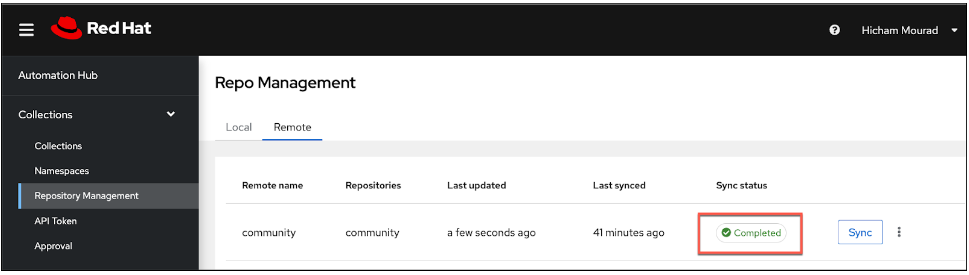

8. Go back to the “**Collections**” menu on the left, and then select “**Collections**”, adjust the “**Filter by repository**” to “**Community**” and notice you now DO have content there.
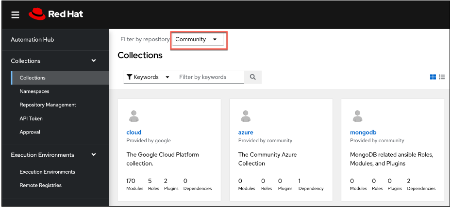

9. This Community content can now be consumed by the Ansible Automation Controller.


***
<h5>Scaling AAP on AWS using Extension nodes.</h5>


**Instructions**:


1. If you want to experiment with scaling your AAP on AWS environment, you can do this by adding the **Extension Node 100** to your foundation AAP deployment performed earlier
2. To do this simply follow the steps located at that page:  [https://access.redhat.com/documentation/en-us/ansible_on_clouds/2.x/html/red_hat_ansible_automation_platform_from_aws_marketplace_guide/assembly-aap-aws-extension](https://access.redhat.com/documentation/en-us/ansible_on_clouds/2.x/html/red_hat_ansible_automation_platform_from_aws_marketplace_guide/assembly-aap-aws-extension)
