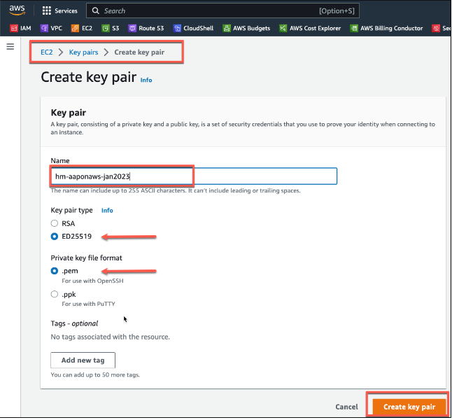

<h1>Prepare Provided AWS Account with Prerequisite Resources</h1>

**Task**: Create resources necessary for successful Ansible Automation Platform on AWS deployment

**Instructions**:

1. [Sign in to the AWS Console](https://aws.amazon.com/premiumsupport/knowledge-center/sign-in-console/) with the provided AWS credentials
2. [Choose a region](https://docs.aws.amazon.com/awsconsolehelpdocs/latest/gsg/select-region.html) for deploying AAP on AWS (Please use one of the following 4 regions: **us-east-1** or **us-east-2** or **us-west-1** or **us-west-2**).  Make sure the right region is selected in the top right corner of the AWS console window.
3. [Create a key pair](https://docs.aws.amazon.com/AWSEC2/latest/UserGuide/create-key-pairs.html) in the chosen region. In the navigation pane traverse to the **EC2** console and locate **Network & Security**, choose **Key Pairs**.  Choose **Create key pair**.
4. The AAP on AWS deployment will use this key pair to deploy EC2 instances in the chosen region. Use the name **\<your-initials\>-aaponaws-\<monthyear\> (ex: hm-aaponaws-jan2023)**, Key pair type **ed25519**, and Private key file format **.pem**. Replace <your-initials> with your initials.

5. Please note, it could take up to 5 minutes for the key pair to show up in the UI for some regions.
6. When prompted to save the .pem key please save it to your desktop.

[NEXT- Subscribe to the Red Hat Ansible Automation Platform on the AWS PRIVATE OFFER in the AWS Marketplace](page2.md)
