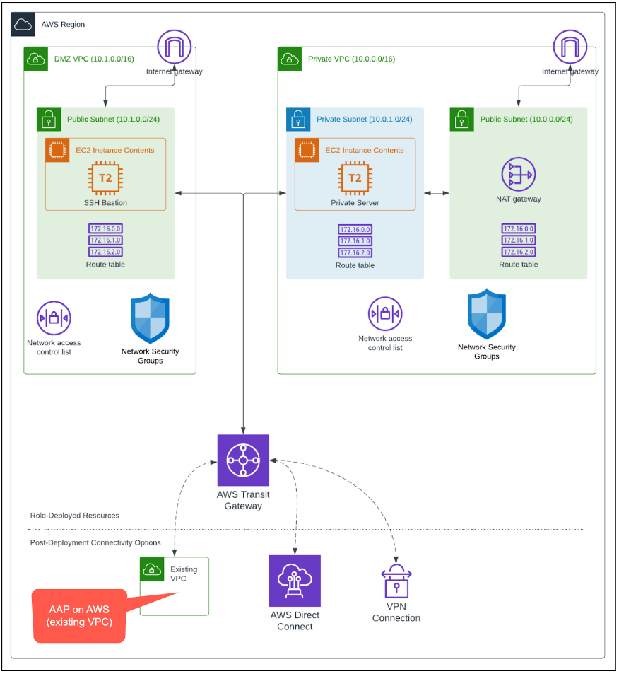
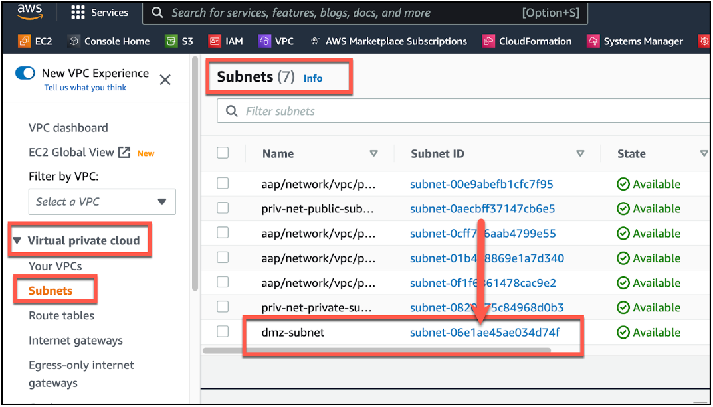
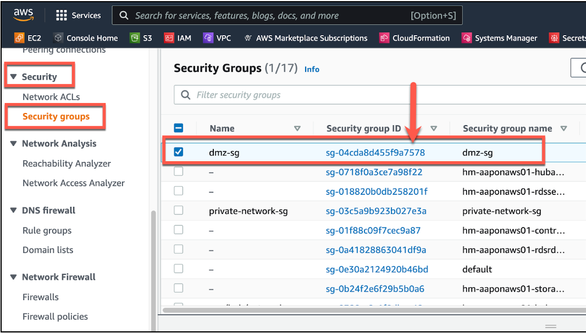

<h1>Ansible Automation Controller Functionality</h1>

**Task**: Verify that Ansible Automation Controller works as expected given your experience with Automation Controller in AAP.

**Success Criteria**: Ability to run pre-configured or provided job templates.

**Instructions**:

1. Run **AWS - Create Transit Network** template (will take 10 minutes or more to complete).  **Resources** -> **Templates** -> **AWS - Create Transit Network**, and click the launch icon.   **When the job has completed Successfully**, move to step 2.
2. In the AWS Console, verify that you now have the following architecture deployed in the region that you defined in the extra-vars for the template.
    1. EC2 Dashboard screen - Ensure that there are **two new EC2 instances** running (dmz-..., priv-....)
    2. VPC dashboard screen - Ensure that there are **two new VPCs** (dmz-vpc, private-network-vpc), in addition to the one originally created by the AAP on AWS deployment.
    3. VPC dashboard screen - Ensure that there are **additional subnets** (dmz-subnet, priv-net-public-subnet, priv-net-private-subnet).
    4. VPC Dashboard screen - Ensure that there is a **Transit Gateway** (transit-gw)
    5. Ensure that there are **Transit Gateway peerings** between the two VPCs. (VPC dashboard -> Transit gateways -> Transit gateway attachments).  (dmz-peer, priv-network-peer)



3. In the AWS Console - **VPC Dashboard** -> **Your VPCs** -> **dmz-vpc** , collect the **Subnet ID** for the **DMZ-VPC** subnet and the **Security group ID** for the subnet.





4. Run the **AWS - Create RHEL 8 VM** template.

```
---
aws_region: <your-aws-region>
aws_keypair_name: <your-initials>-aaponaws-mar2023
aws_instance_size: t2.micro
vm_blueprint: rhel8
aws_securitygroup_name: dmz-sg
aws_vpc_subnet_name: dmz-subnet
```


5. Verify that you have a new EC2 instance running named **demo_vm**.

[NEXT - Deprovision Resources](page13.md)
