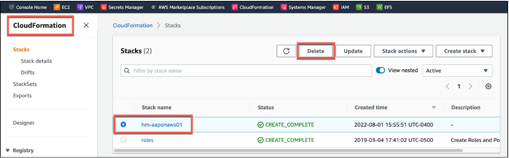

<h1>Deprovision Resources</h1>

**Task**: Deprovision the instance of Red Hat Ansible Automation Platform on AWS.

**Success Criteria**: Removal of all Red Hat Ansible Automation Platform on AWS resources within your AWS  environment.

**Instructions**:

1. Run the **AWS - Delete RHEL 8 VM** template (can take 3 - 5 mins).
2. Run the **AWS - Delete Transit Network** template (can take approx 20 mins).
3. Delete the 2 **Network load balancers** you created earlier.  (These were created outside of the AAP on AWS cloudformation deployment)
4. Delete the 2 **Target groups** you created earlier.  (These were created outside of the AAP on AWS cloudformation deployment)
5. Follow instructions on [Deleting a stack on the AWS CloudFormation console](https://docs.aws.amazon.com/AWSCloudFormation/latest/UserGuide/cfn-console-delete-stack.html). This process can take up to 45 minutes or more.

**NOTE:  (Only perform steps 3 through 5 if you do NOT want to perform the testing in the Appendix)**.

