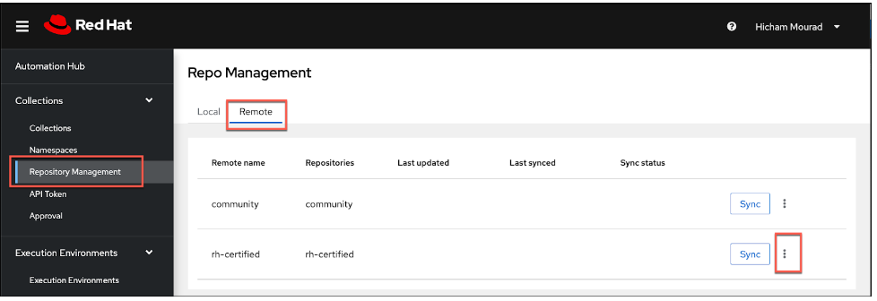
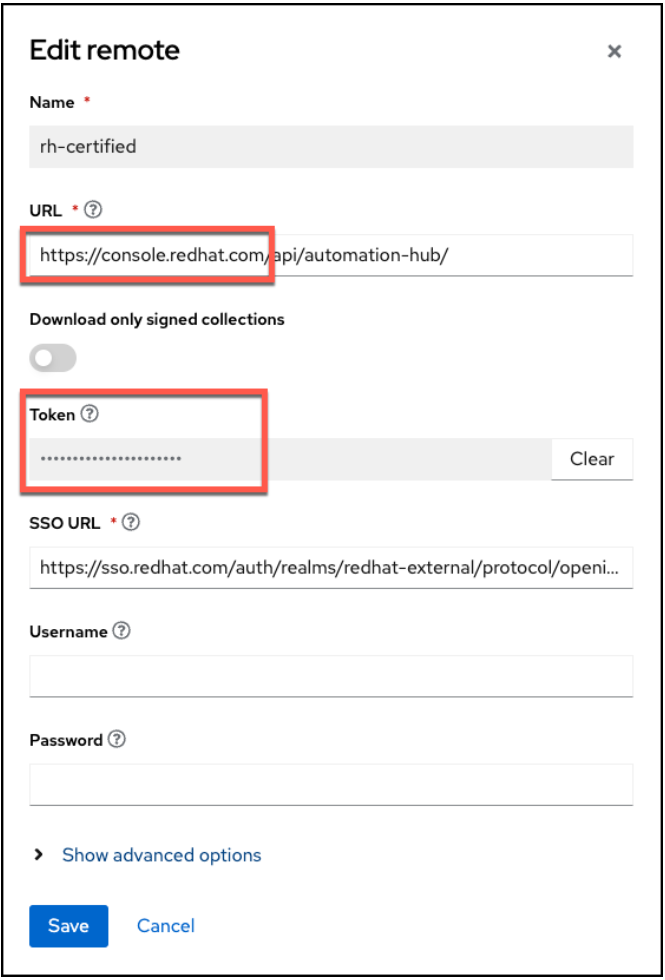
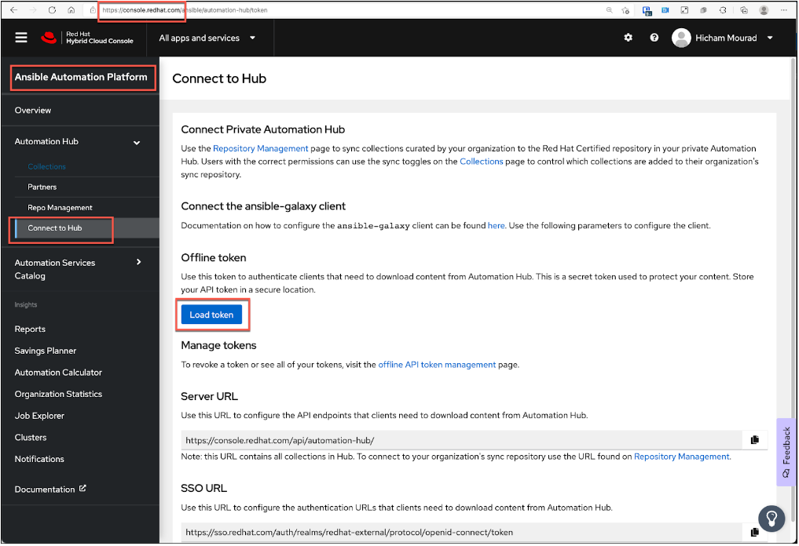
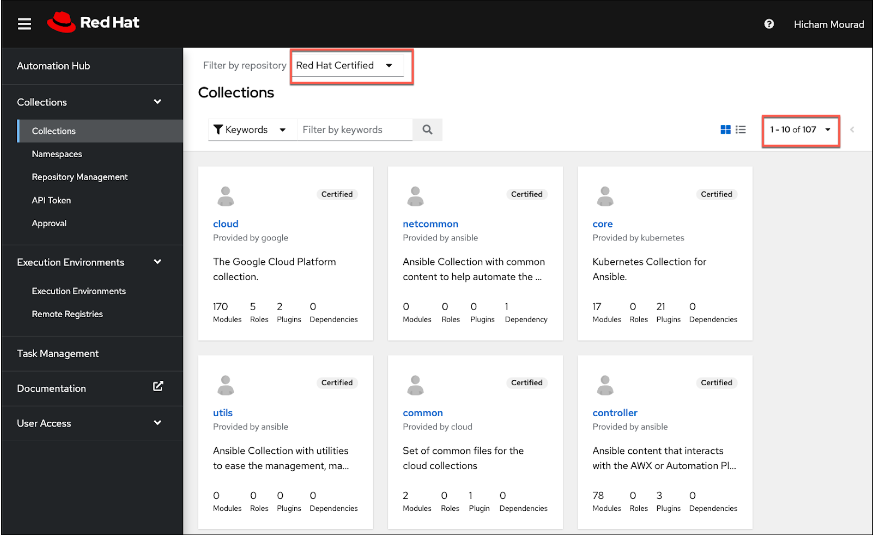
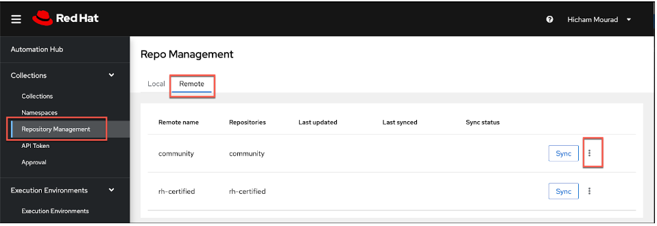
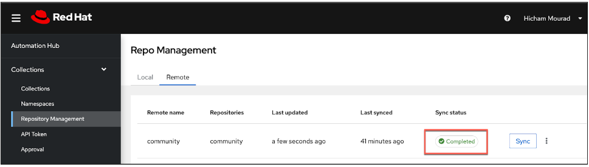
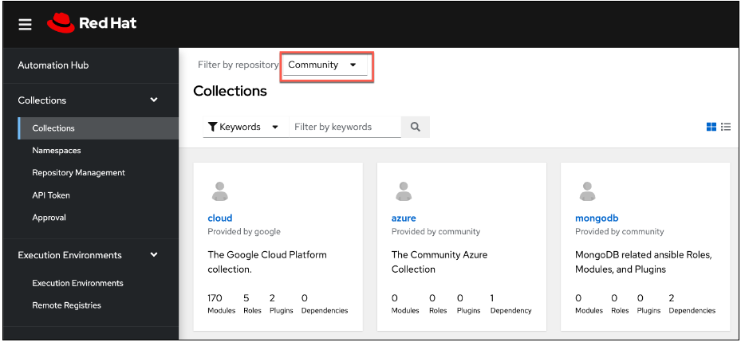

<h2>Appendix</h2>


---

<h3>Optional Testing</h3>


<h4>Custom Automation Testing</h4>


**Task**: Verify an existing automation that is not provided by Red Hat works

**Success Criteria**: Identification that your existing automation works as expected using Red Hat Ansible Automation Platform on AWS

**Instructions**:

Customers have the full functionality of the Ansible Automation Platform as part of their deployment on AWS.  If you regularly use Ansible Automation Platform and you have playbooks that you use, then please feel free to test their operational ability within your AAP on AWS environment.

<h4>Private Automation Hub (synchronize curated Ansible content)</h4>


**Task**: Synchronize curated Ansible content from galaxy.ansible.com (community content), and then from Red Hat Automation Hub (Red Hat certified content).

**Success Criteria**: The content will synchronize successfully and be available in the Private Automation Hub.

<h5>Synchronize **Red Hat Certified** Ansible content</h5>


**Instructions**:


1. Log in to the Private Automation Hub UI.  Use admin for the username, and the Administrator Password you retrieved earlier.
2. Expand the **Collections** menu on the left, and then select **Collections**, adjust the **Filter by repository** to **Red Hat Certified** and notice you have NO content there.
3. Select **Repository Management** from the menu on the left, and then select **Remote**.


4. Select the **3 vertical dots** (vertical ellipsis), and then select **Edit** to synchronize Red Hat certified content from Red Hat Automation Hub on console.redhat.com.
5. Here you have **two options**, the first is to use a **Token**, <span style="text-decoration:underline;">OR</span> the second which is to use your **Red Hat account** on console.redhat.com.  I would recommend **TOKEN**.



6. If you choose to use the **Token** connection method, you will have to login to console.redhat.com and go to the Ansible Automation Hub, and grab the Token.



7. Insert the Token you just grabbed from console.redhat.com <span style="text-decoration:underline;">OR</span> your Red Hat username and password in the connection dialog and click **Save**, and then select the **Sync** button.  After a few minutes you should see this has completed successfully.


8. Go back to the **Collections** menu on the left, and then select **Collections**, adjust the **Filter by repository** to **Red Hat Certified** and notice you now DO have content there.



9. This Red Hat Certified content can now be consumed by the Ansible Automation Controller.

<h5>Synchronize curated Ansible **Community** content</h5>


**Instructions**:


1. Log in to the Private Automation Hub UI.  If you dont have the URL, please copy it from the Azure AAP application on the **Parameters and OutPuts** page.  Look for **automationHubUrl**.
2. Expand the **Collections** menu on the left, and then select **Collections**, adjust the **Filter by repository** to **Community** and notice you have NO content there.
3. Select **Repository Management** from the menu on the left, and then select **Remote**.



4. Select the **3 vertical dots** (vertical ellipsis), and then select **Edit** to configure the community repository ([https://galaxy.ansible.com](https://galaxy.ansible.com)) connection and configuration.

5. Create a file on your computer called **requirements.yml** with the following content.


```
---
collections:
 # Install a collection from Ansible Galaxy.

 - name: community.mongodb
   source: https://galaxy.ansible.com

 - name: community.general
   source: https://galaxy.ansible.com

```


6. Select **Browse** and point to the **requirements.yml **file on your machine.
7. Select **Save** and then select the **Sync** button.  After a few minutes you should see this has completed successfully.



8. Go back to the **Collections** menu on the left, and then select **Collections**, adjust the **Filter by repository** to **Community** and notice you now DO have content there.


9. This Community content can now be consumed by the Ansible Automation Controller.


***
<h5>Scaling AAP on AWS using Extension nodes.</h5>


**Instructions**:


1. If you want to experiment with scaling your AAP on AWS environment, you can do this by adding the **Extension Node 100** to your foundation AAP deployment performed earlier
2. To do this simply follow the steps located at that page:  [https://access.redhat.com/documentation/en-us/ansible_on_clouds/2.x/html/red_hat_ansible_automation_platform_from_aws_marketplace_guide/assembly-aap-aws-extension](https://access.redhat.com/documentation/en-us/ansible_on_clouds/2.x/html/red_hat_ansible_automation_platform_from_aws_marketplace_guide/assembly-aap-aws-extension)
