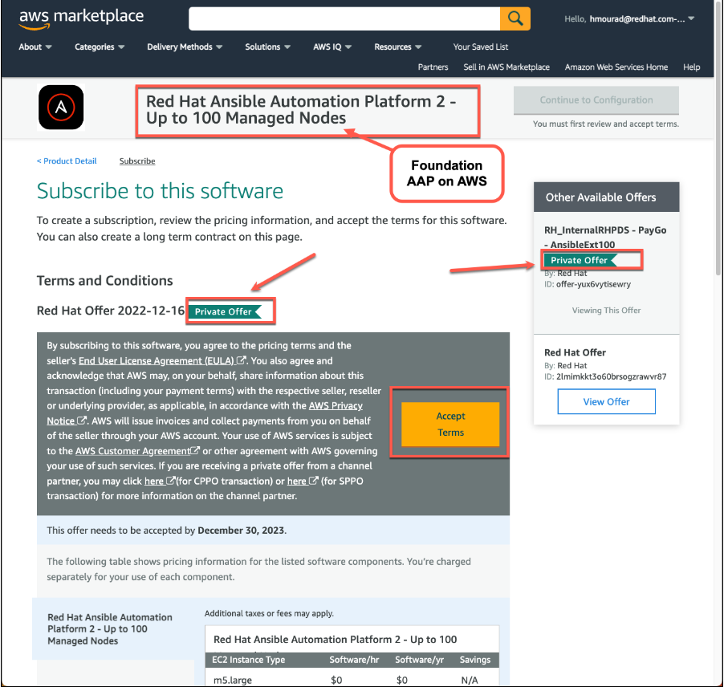
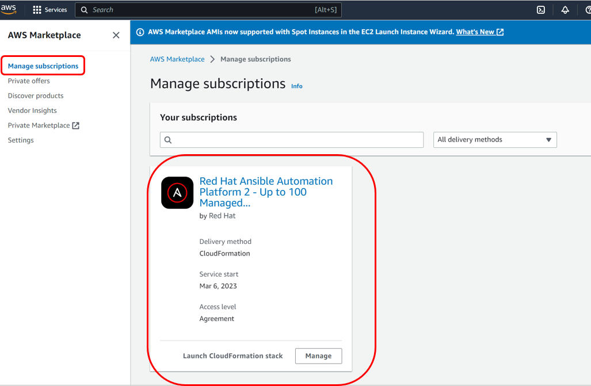
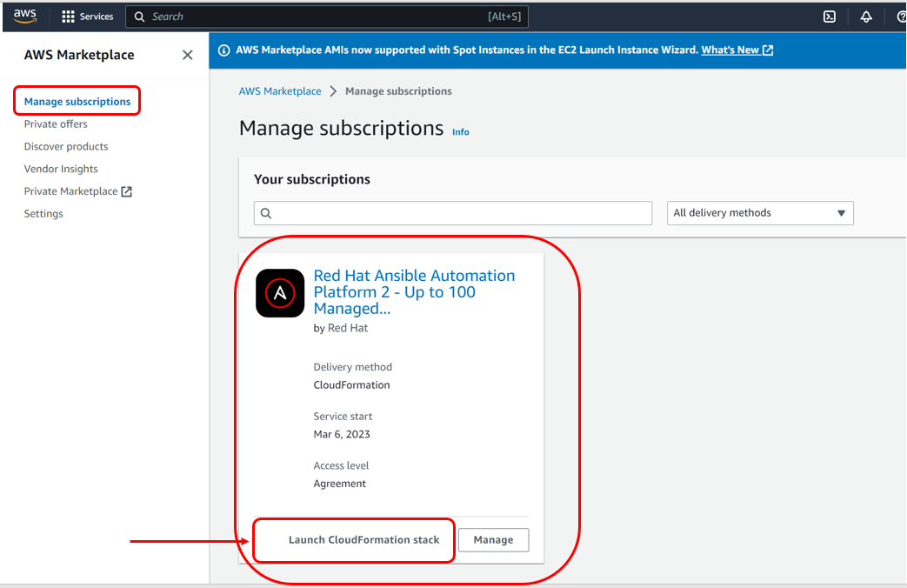

<h1>Subscribe to the Red Hat Ansible Automation Platform</h1>

**Task**: In this section we will **subscribe to the Ansible Automation Platform** using the **AWS Private Offer in the AWS Marketplace**.

**Instructions**:

1. Make sure you are **logged in to the AWS console** using the credentials provided by your instructor.
2. Copy and Paste the **AAP on AWS Foundation (Base Ansible) - Private offer** link into your browser:  [https://aws.amazon.com/marketplace/fulfillment?productId=2bedd837-fd50-4766-8ea0-7efc4fce9397&offerId=offer-yux6vytisewry](https://aws.amazon.com/marketplace/fulfillment?productId=2bedd837-fd50-4766-8ea0-7efc4fce9397&offerId=offer-yux6vytisewry)

3. Click on **Accept Terms**.  Wait a few moments until the subscription process is complete.  You will see a note stating **Thank you for subscribing to this product!  We are processing your request.**

4. Next navigate to the **AWS Marketplace -> Manage subscriptions** AWS console menu, then you will see the following:

5. Now you are [Subscribed to the AMI Private Offer](https://docs.aws.amazon.com/marketplace/latest/buyerguide/buyer-private-offers-subscribing-ami-private-offer.html) named **Red Hat Ansible Automation Platform 2 - Up to 100 Managed Nodes.**
6. After subscribing to the Foundational offer, Let’s go ahead and start to deploy Ansible Automation Platform on AWS by clicking on **Launch Cloud Formation Stack**.

[NEXT - Provision Red Hat Ansible Automation Platform on AWS](page3.md)