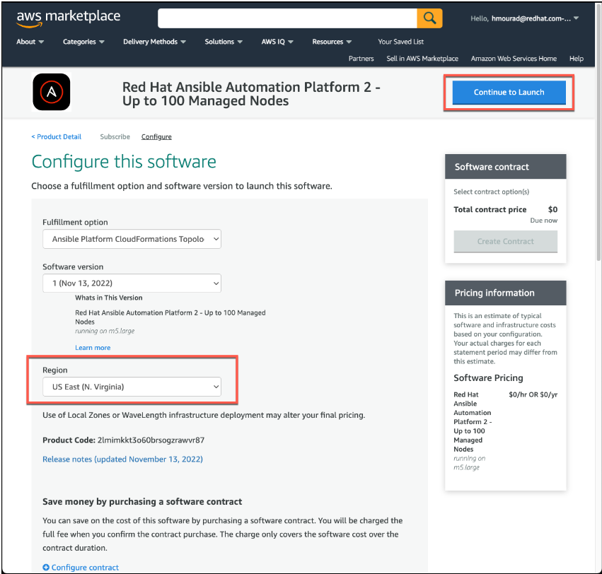
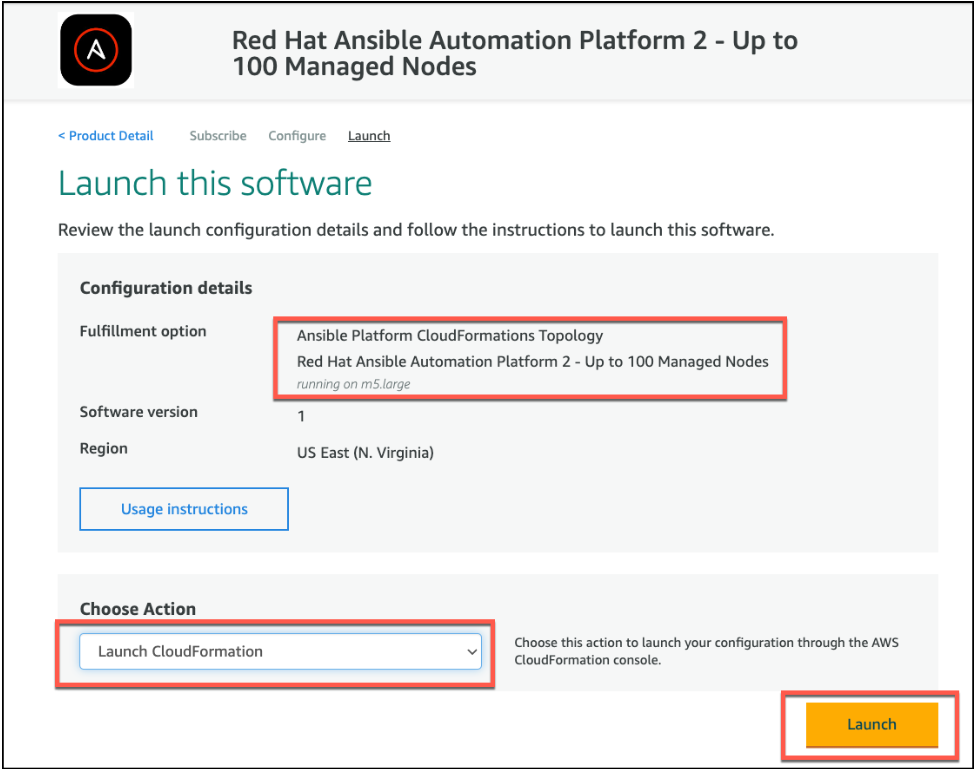
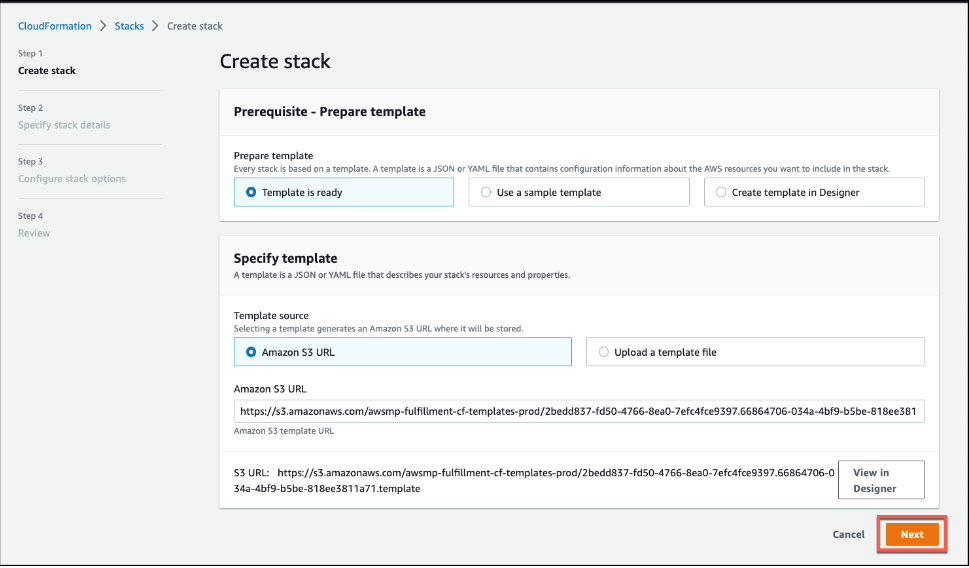
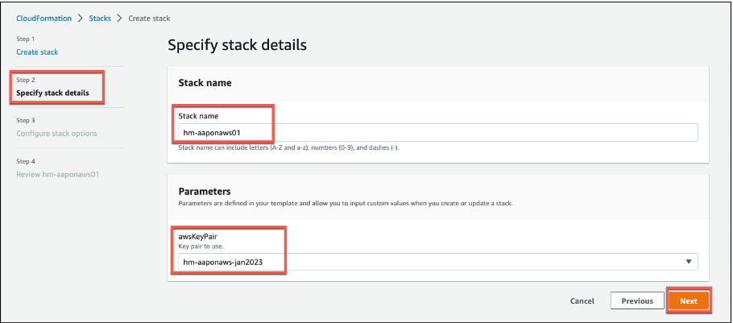
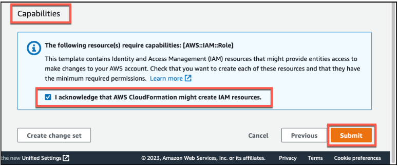
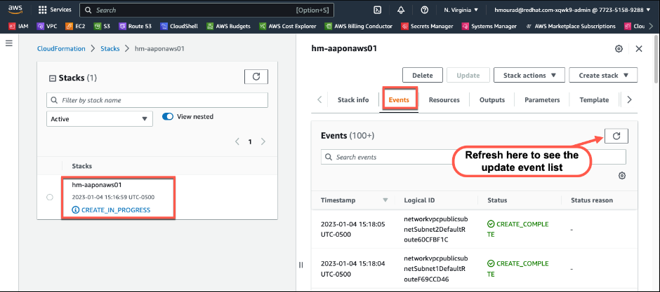
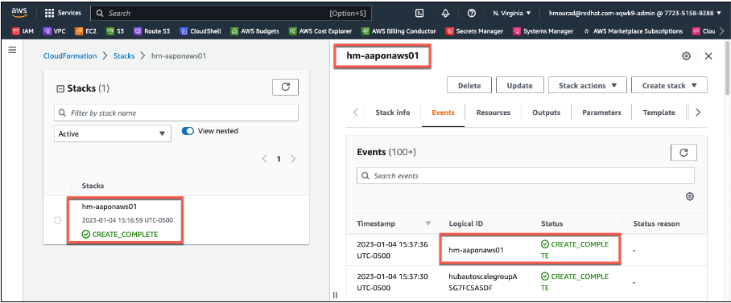

<h1>Provision Red Hat Ansible Automation Platform on AWS</h1>

**Task**: Provision Red Hat Ansible Automation Platform on AWS.

**Instructions**:

1. Now that you have launched the cloudformation stack, you’re ready to start configuration prior to launching the AAP on AWS offer.
2. For the **Fulfillment option**, please select **Ansible Platform CloudFormation Topology.**
3. For the **Software version**, please select the latest version / date available in the list.
4. For the **Region**, please select the region that you decided on earlier
5. Select **Continue to Launch**.

6. On the following screen, select **Launch CloudFormation** from the **Choose Action** dropdown list, and then select **Launch**.

7. **Create Stack**.  Select **Next**

8. **Specify stack details**
    1. Please enter the unique stack name (Replace \<your-initials\> with your initials): **\<your-initials\>-aaponaws01**
    2. Parameters: **\<your-initials\>-aaponaws-\<monthyear\>** from the drop-down menu,
    3. Select **Next**

9. **Configure stack options**.  No changes are necessary. All configurations are optional or have the correct default values. Scroll to the bottom, and select **Next** until you reach Step 4, Review
10. **Review <stackname>**.  Scroll to the bottom, then under **Capabilities**, acknowledge that CloudFormation may create IAM resources by **selecting the checkbox**.  Then select **Submit**.

The application will begin provisioning.

It may take 30 minutes or longer for the infrastructure and application to fully provision.

---
**NOTE:**
**Troubleshooting / Workaround note**.  If for some reason you experience a deployment failure you will need to delete the deployment stack, wait a few minutes, and start over please.
---

[NEXT - Expose the Ansible UIs and APIs to the Network](page4.md)