<h1>Expose the Ansible UIs and APIs to the Network</h1>

**Task**: Expose the Ansible UIs and APIs to the Network

When AAP on AWS is deployed, it is deployed into an isolated VPC and cannot be accessed.    The following instructions will follow a model of exposing the Ansible UIs and APIs to the public internet for access.  There are other ways to access the platform via private networks, but those require advanced configuration that is not covered in the scope of this environment.

    **Success Criteria**: The ability to access both Automation Controller and Private Automation Hub user interfaces.

**Instructions**:

AAP on AWS is deployed into its own VPC on a private network.  In order to access the application UI�s (controller and hub) there are some steps to follow

# 1. First, please verify that you are still in the same AWS region that you created your AAP on AWS deployment.
# 2. Create a target group for the Automation Controller.  

    Target groups route requests to one or more registered targets, such as EC2 instances, using the protocol and port number that you specify.

From the **EC2 dashboard** scroll down to the **Target Groups** under **Load Balancing**.

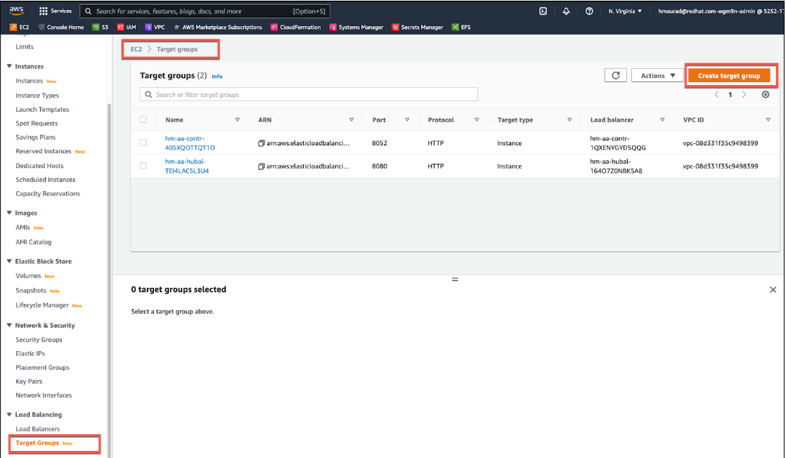

## 2.1. Select **Create target group**.  
1. For Target type, change from Instance to **Application Load Balancer**.  
2. Enter a **Target group name** of **controller-tg**
3. From the **VPC** drop-down select your **aap/network/vpc**.  
4. Then click **Next**.

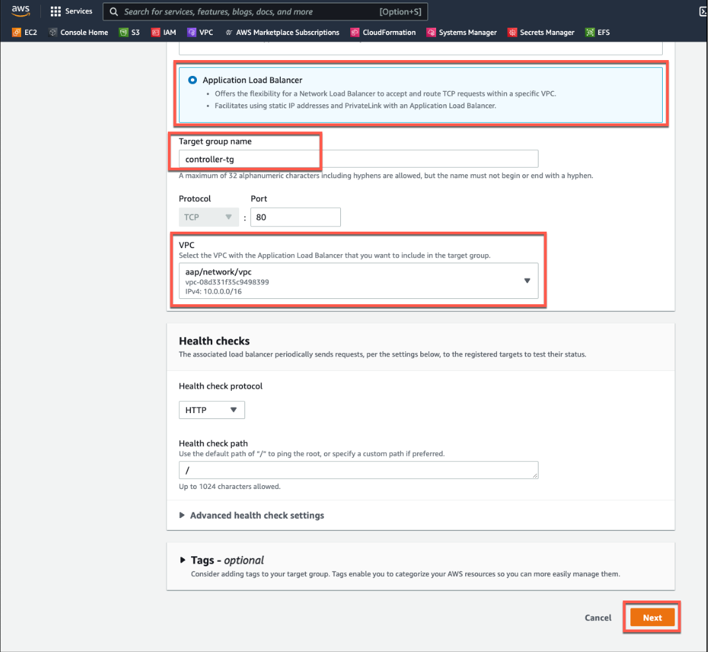

## 2.2. On the next screen register the target(s).  
1. From the drop-down select the **Controllers** load balancer. 

2. It will be named **\<your-initials\>-aa-contr-\<generated-string\>,** where **\<your-initials\>** is your initials and **\<generated-string\>** is a string of random characters. 

3. Then select **Create target group**.
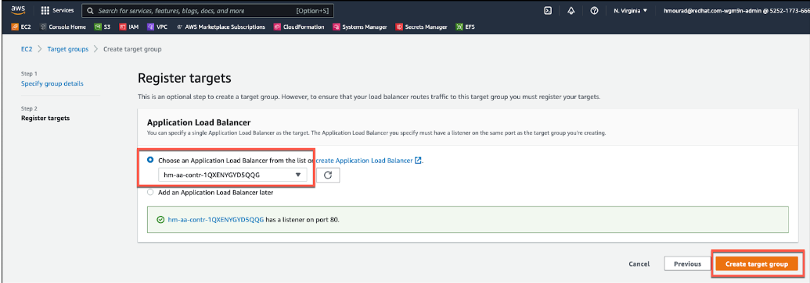

# 3. Similarly, Create a target group for the Private Automation Hub.  

1. From the **EC2 dashboard** scroll down to the **Target Groups** under **Load Balancing**.

1. Select **Create target group**.  

1. For Target type, change from Instance to **Application Load Balancer**.  

1. Enter a **Target group name** of **hub-tg**

1. From the **VPC** drop-down select your **aap/network/vpc**.  

1. Click **Next**.

1. On the next screen register the target(s).  

1. From the drop-down select the **Hubs** load balancer.  It will be named **\<your-initials\>-aa-hubal-\<generated-string\>,** where **\<your-initials\>** is your initials and **\<generated-string\>** is a string of random characters. 

1. Then select **Create target group**.

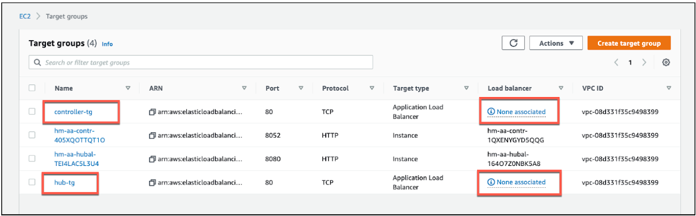

# 4. Now, select  **Load Balancers** in the **Load Balancing** menu.
# 5. Create a network load balancer for the Automation Controller
1. Select **Create Load Balancer**
2. Select **Create** under the **Network Load Balancer** column

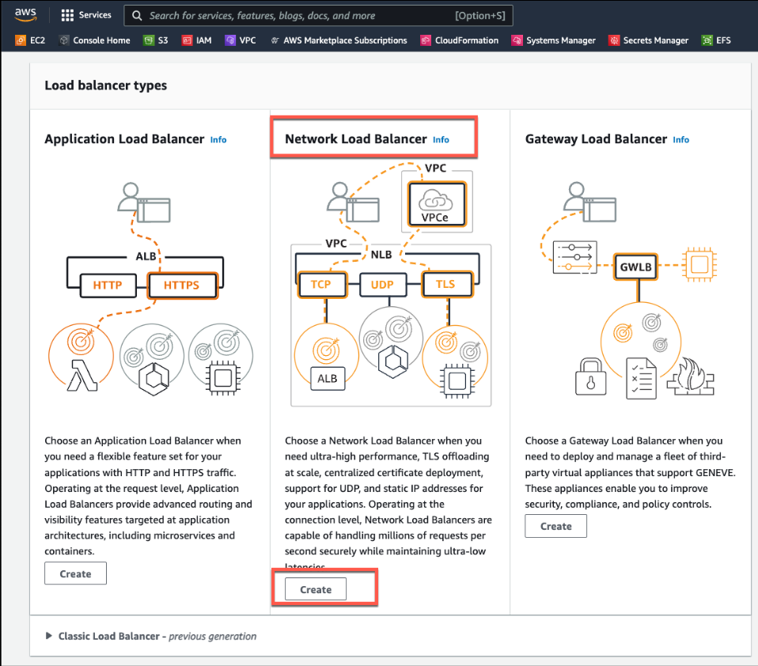

3. For the Load balancer name call it **controller**

4. From the **VPC** drop-down select your **aap/network/vpc**

5. Under **Mappings** select the availability zones and from the drop-down make sure you have selected the **PUBLIC subnet**

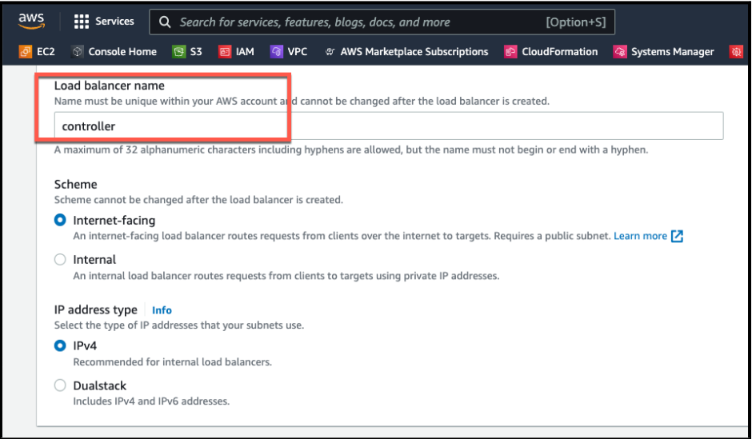

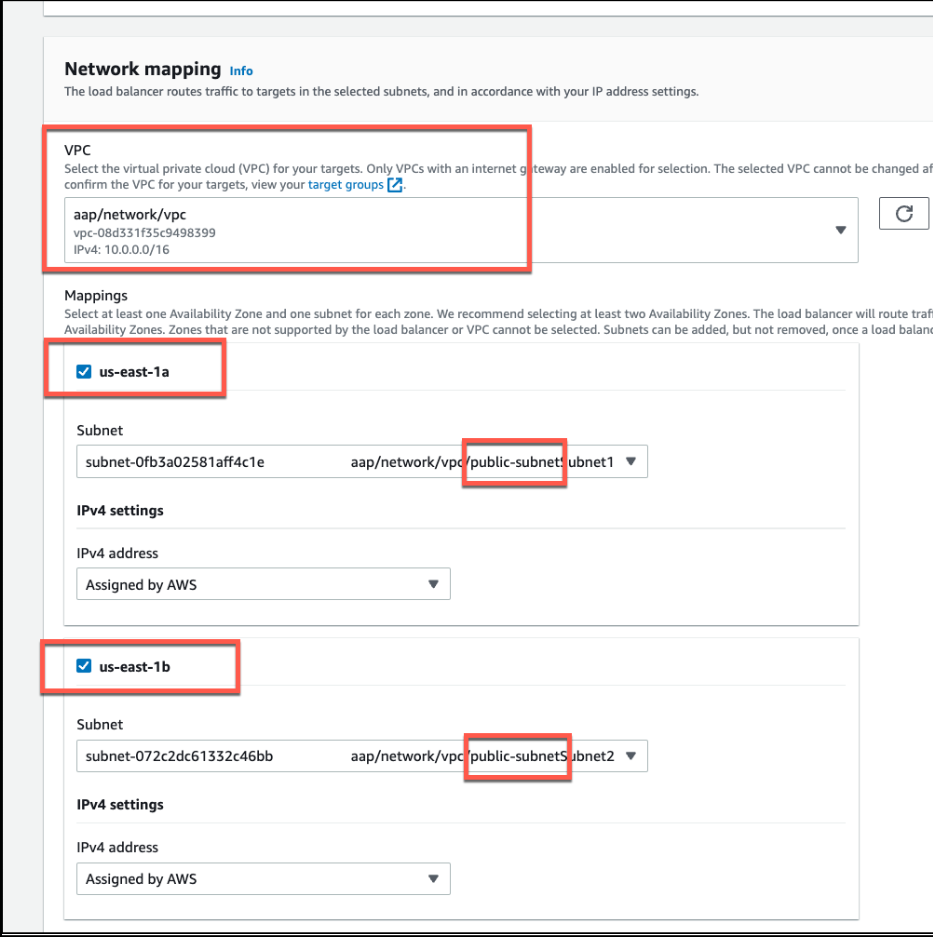

6. Continue scrolling down to create a TCP Listener under **Listeners and routing**.
7. From the **Default action** drop-down select **controller-tg**, then scroll down and select **Create load balancer**

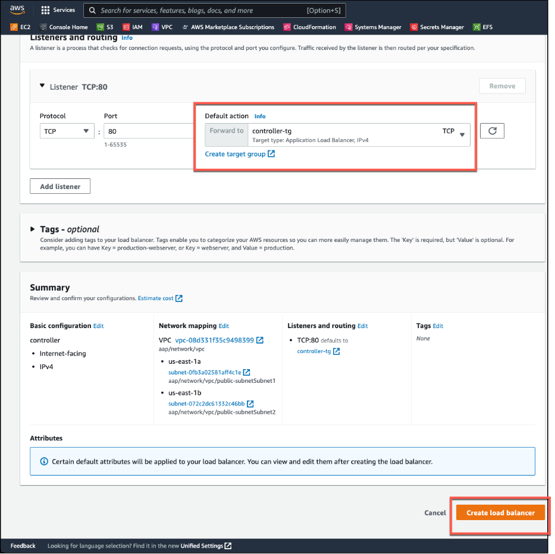

# 6. Similarly, create a network load balancer for the Private Automation Hub
1. Return to the **Load Balancers** console.
2. Select **Create Load Balancer**, then from the screen you are presented with, select **Create** under the **Network Load Balancer** column
3. For the Load balancer name call it **hub**
4. From the **VPC** drop-down select your **aap/network/vpc**.
5. Under **Mappings** select the availability zones and from the drop-down make sure you have selected the **PUBLIC subnet**
6. Continue scrolling down to create a TCP Listener under **Listeners and routing.**
7. From the **Default action** drop-down select **hub-tg**, then scroll down and select **Create load balancer**

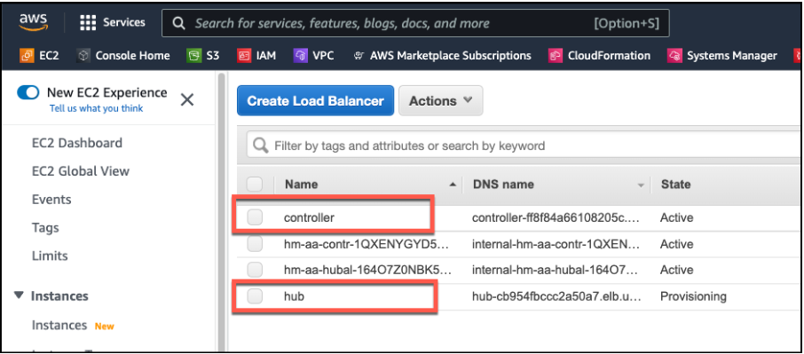

# 7. Visit the **Load Balancers** console to view the load balancers you created. 
    It might take a few minutes for the load balancer status to change from **Provisioning** to **Active.** Continue to the next step when both Load Balancers have a **State** of **Active**.

# 8. To get the URLs for the Automation controller and Private automation hub, select each load balancer respectively (**controller** and **hub**), and copy the **DNS name** URL.  
    The URL provided for the **Controller** Load Balancer equates to how someone would access the Ansible Automat Platform Console, and the **Hub** URL is for the Automation Hub Console.

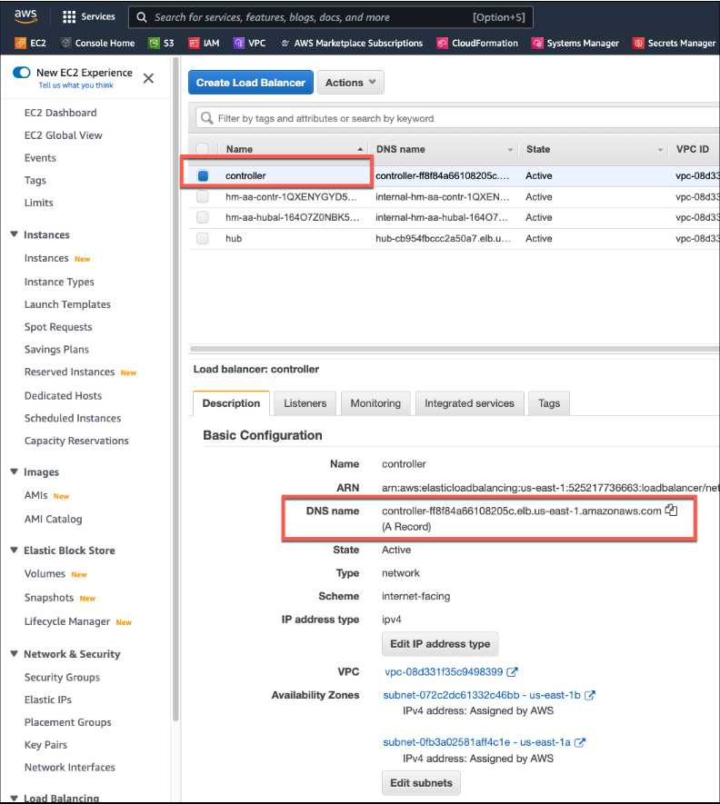

# 9.  Open two browser tabs with the controller and hub URLs.
1. Expected Controller UI

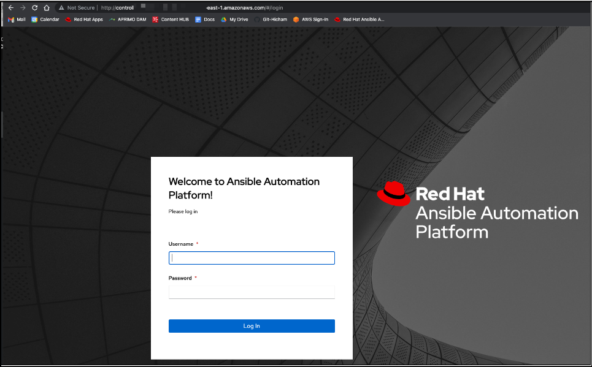

2. Expected Hub UI:

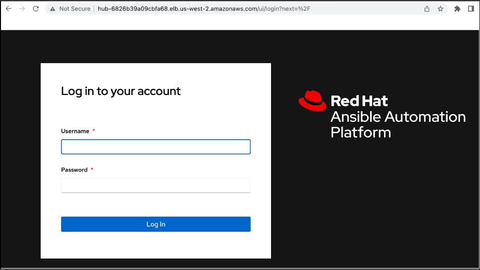

# [NEXT - Login to Ansible](page5.md)