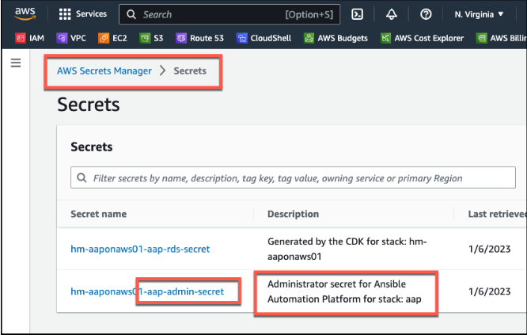

<h1>Login to Ansible</h1>

**Task**: Obtain the admin password and successfully login to both controller and hub graphical user interfaces.

**Instructions**:

1. Open the AWS **Secrets Manager** service, and select **Secrets**
2. Select the **Secret name** that ends with **-aap-admin-secret**

3. On the next screen scroll down to the **Secret value** section, and select **Retrieve secret value**, and copy the **admin** password.
4. Use this Username and Password combination to Login to the Ansible Automation Platform and the Automation Hub consoles.

# [NEXT - Access Automation Controller Console](page6.md)
