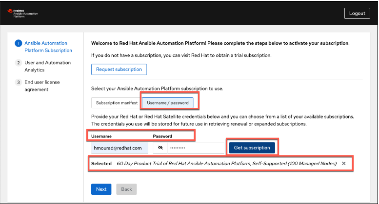

<h1>Access Automation Controller console</h1>

**Task**: Access Automation Controller console.

**Success Criteria**: Automation Controller console accessed and developer subscription enabled

**Instructions**:

1. Login to the Ansible Automation Platform console using the **admin** username and password
2. Activate a Red Hat Ansible Automation Platform subscription
    1. **_Associate subscription from access.redhat.com_**
        1. Select the **Username / password** tab.
        2. Use your Red Hat credentials (access.redhat.com) to retrieve subscription options.
        3. Select a subscription. The **60 Day Product Trial** for **Red Hat Ansible Automation Platform** is a safe default.
        4. Select **Next**.

3. User and Automation Analytics
    1. Disable User analytics and Automation Analytics by unselecting the check boxes.
    2. Select **Next**.
4. End user license agreement
    1. Read the agreement and select **Submit**.

[NEXT - Create Ansible Credentials Containing AWS Access Key](page7.md)