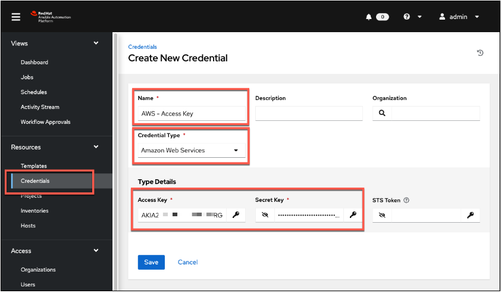

<h1>Create Ansible Credentials Containing AWS Access Key</h1>

**Task**: Create new Ansible Credentials

1. Click the “**Resources**” in the left menu, then click “**Credentials**”.
2. Click the “**Add**” button.
3. Select “**Amazon Web Services**” from the **Credential Type** drop down menu.
4. Fill the following fields:
    1. **Name:** AWS - Access Key
    2. **Access Key:** Use the access key provided your instructor at the beginning of the class.
    3. **Secret Key:** Use the secret key provided your instructor at the beginning of the class.

5. Click the “**Save**” button.

[NEXT - Add New Execution Environment](page8.md)