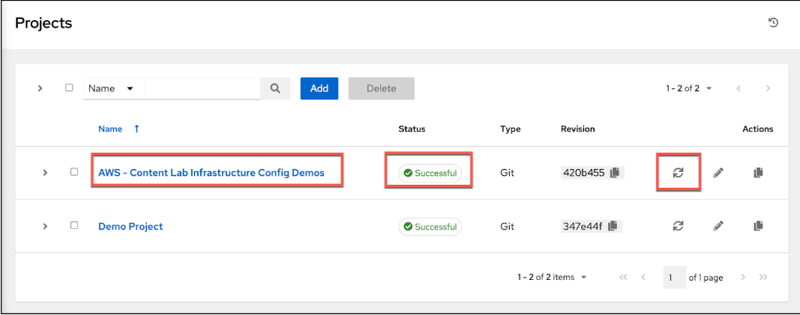

<h1>Add New Execution Environment</h1>

1. Click the **Execution Environments** link under **Administration** in the left menu.
2. Click the **Add** button.
3. Fill the following fields:
    1. **Name**: ```Cloud EE```
    2. **Image**: ```quay.io/scottharwell/aws-ee:latest```
4. Click **Save** at the bottom of the screen.

<h1>Create New Projects</h1>

1. Click the **Projects** link under **Resources** in the left menu.
2. Click the **Add** button.
3. Fill the following fields:
    1. **Name**:  ```AWS - Content Lab Infrastructure Config Demos```
    2. **Execution Environment**: Cloud EE
    3. **Organization**: Default
    4. **Source Control Type**: Git
    5. **Source Control URL**: ```https://github.com/ansible-content-lab/aws.infrastructure_config_demos.git```
4. Click **Save** at the bottom of the screen.

Make sure it has synchronized and shows **Successful**.  If it doesnt show successful you can click on the synchronize **icon** in the **Actions** column.




[NEXT - Create Job Templates](page9.md)